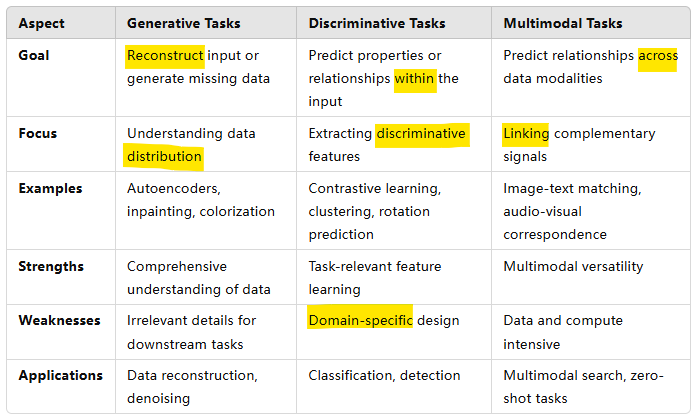
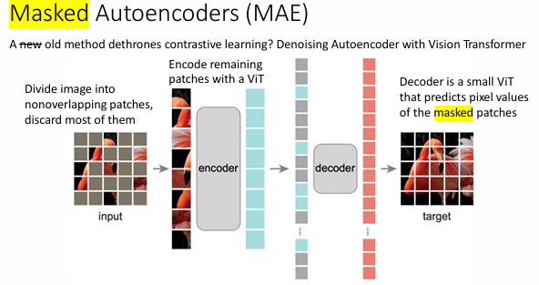
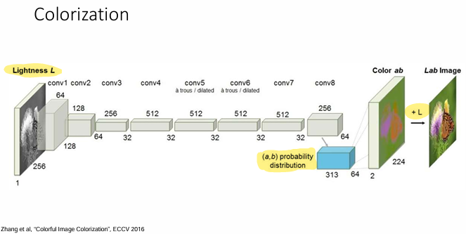
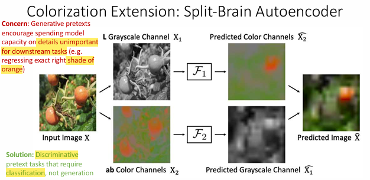
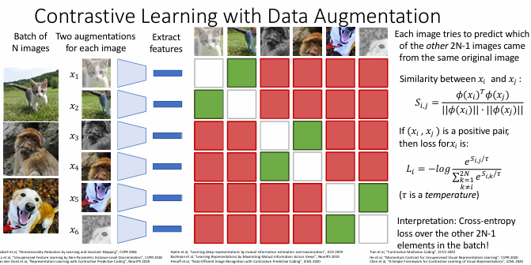
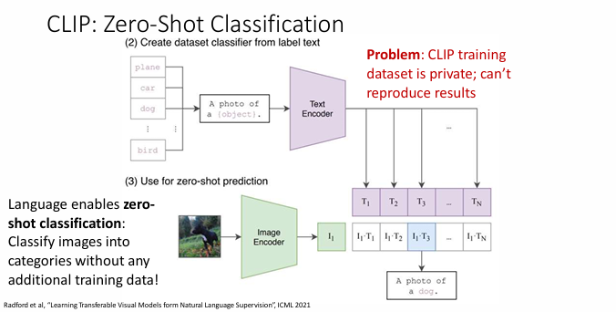

**Background**:

- **Supervised Learning** relies on labeled data: costly and time-consuming to annotate.
- **Unsupervised Learning** seeks patterns in unlabeled data but doesn't predict specific outcomes.
- **Semi-Supervised Learning**: Train jointly with some labeled data and (a lot) of unlabeled data.

---

### 1. Core Concepts

**Self-Supervised Learning (SSL)**:

- Definition: Learning from raw data without annotations by using pretext tasks.
- Advantages: Reduces dependency on labeled data, improves scalability.
- Key Steps: Pretraining (on pretext tasks) → Transfer to downstream tasks.
- Types of Pretext Tasks:
  

#### 1.1 Generative Tasks

1. Sparse AutoEncoders: Train an autoencoder to reconstruct inputs with sparse activations (mostly 0).
2. Denoising Autoencoder: Train an autoencoder to reconstruct noisy inputs (pixels randomly set to zero)
3. Masked Autoencoder: Masks portions of the input (e.g., image patches) and learns to reconstruct the missing parts.

   - Efficient and scalable for large models like Vision Transformers (ViTs).
     
4. Inpainting: Predict missing regions in an image.
   encoder + decoder

   1. Mask a portion of the input image (e.g., rectangular or irregular regions).
   2. Train the model to predict the missing pixels based on the visible parts of the image.
   3. Use a loss function (e.g., L2 loss (+ adversarial loss _best_)) to evaluate the quality of the reconstruction.

   - strength: rich feature learining, global+local context
   - lim: specific scenarios, computational cost, dependence on masking strat, generative overhead (precise pixel pred, may not align with downstream tasks)
5. Colorization:

   1) For grayscale images, identify objects, then Predict colors.
      
   2) Split-Brain Autoencoder
      

#### 1.2 Discriminative Tasks

1. Contrastive Learning: Distinguish between similar (positive) and dissimilar (negative) samples.
   - Contrastive loss: Each image predicts which caption matches
   - similarity: Euclidean distance
   - generate positive pairs:
     - data augmentation
     - 
2. Context Prediction: Predict spatial & semantic relationships between image patches. tasks, like predicting the **relative** location of one patch to another.
   Eg: Given two image patches, predict whether one patch is "above," "below," "to the left," or "to the right" of the other.
   **Subset: Jigsaw (拼图)**: shuffling multiple patches, and pred **permutation** of the patches.
   - lim: only work on patches, not whole images! Because patches are localized regions, struggles to model holistic features like obj presence, size or overall composition.
3. Rotation Prediction:RotNet, Classify the degree of rotation (e.g., 0°, 90°, 180°, 270°) applied to an image.
4. Deep Clustering: Group features and assign pseudo-labels to clusters.
   1) steps
      1 Randomly initialize a CNN
      2 Run many images through CNN, get their final-layer features
      3 Cluster the features with K-Means; record cluster for each feature
      4 Use cluster assignments as _pseudo labels_ for each image; train the CNN to predict cluster assignments
      5 repeat, GOTO 2
5. Exemplar CNN:
   recognize the same data instance (e.g., image patches) despite different augmentations like cropping, rotation, scaling, or color jittering.
   - obj:The model predicts which of the original image patches each augmented sample came from (an N-way classification task, where 𝑁 is the number of original patches).
   - strengths: instance-level features, augmentation-invariance, task-agnostic
   - lim: scalability
     - (The final classification layer grows with the number of instances, making it harder to scale to massive datasets.)
     - Risk of Over-fitting

#### 1.3 Multimodal Pretext Tasks

1. CLIP (Contrastive Language-Image Pretraining): Match images with their corresponding text descriptions.
   - why lang.:
     - semantic density, universality(des any concept), scalability(Non-experts can easily caption images; data can also be collected from the web at scale).
     - Language enables **zero-shot classification**:
       the ability of a model to classify data into categories it has never explicitly been trained on. Instead, the model relies on its pretraining and generalization abilities to infer relationships between new data and previously learned representations.
       Dual encoders for image and text.
     - Strengths:
       - Generalization across tasks.
         - muti-modal, link vision and lang.
     - drawback:
       - Dataset bias and closed nature of training data.
       - Dependency on large-scale data and compute.
2. Video Context: Predict relationships between frames and their audio tracks.
3. Sound Correspondence: Learn relationships between an image and its associated ambient sound.

---

### 2. Theoretical Insights and Challenges

1. Fair evaluation of SSL methods is very hard! No theory, so we need to rely on experiment
2. Variability in experimental setups: architecture, datasets, hyperparameters.
3. Current reliance on curated (data that has been carefully selected, organized, and preprocessed to
   meet specific criteria or objectives. This contrasts with raw or unprocessed data, which may include irrelevant,
   noisy, or unbalanced information.) datasets (like ImageNet).
4. Challenges scaling beyond curated or isolated datasets.

---

### 3. Potential Exam Questions

1. Explain the key differences between supervised, unsupervised, and self-supervised learning.
2. Describe how contrastive learning works and its importance in SSL.
3. Explain how CLIP performs zero-shot classification.
4. Compare masked autoencoders with traditional autoencoders in terms of architecture and use cases.
5. Discuss the advantages and challenges of using SSL in multimodal learning.
6. Evaluate the trade-offs between generative and discriminative pretext tasks in SSL.

---

### Study Tips

- Focus on understanding the logic behind pretext tasks and why they enable feature learning.
- Memorize key architectures and loss functions (e.g., contrastive loss, InfoNCE).
- Practice explaining applications like CLIP and masked autoencoders in simple terms.
- Be ready to critique SSL methods, especially around scalability and bias.

### References

https://web.eecs.umich.edu/~justincj/teaching/eecs498/WI2022/