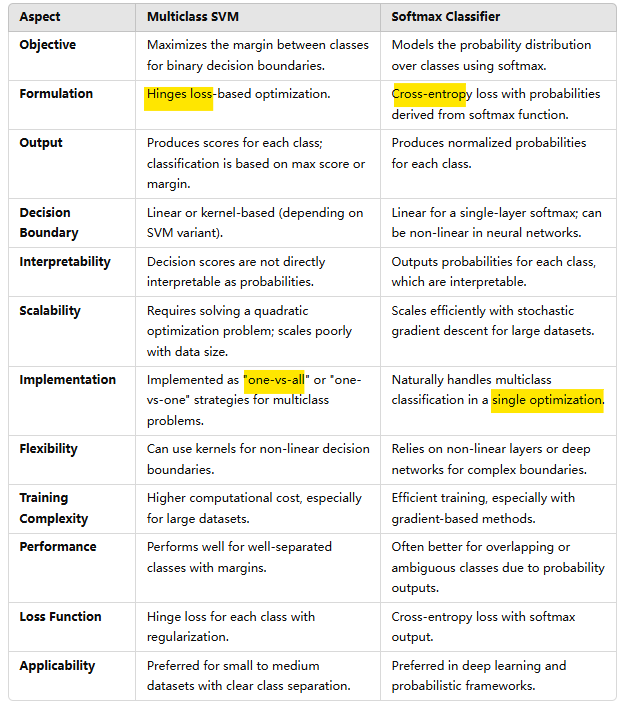
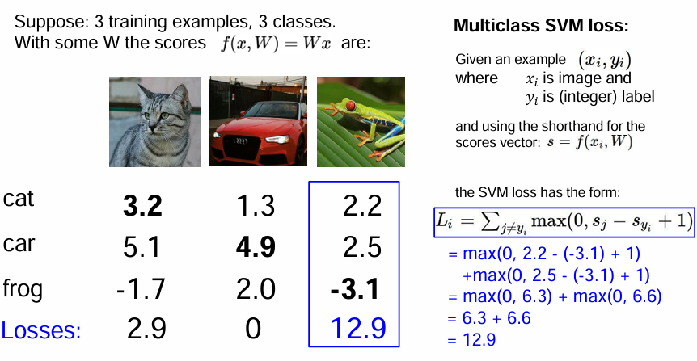

## 1. Image Classification
problems:
- semantic gap: To computers, images are tensors of integers range from [0,255]
- illumination: light
- background clutter (crowd sth. untidily)
- occlusion: blockage
- deformation: different postures of cats
- interclass variation: a picture with many cats
- context (circumstances): a dog with a shadows of a fence may be recognized as a tiger.

$\color{yellow}\text{M: 两个人争吵，打翻了油灯，火花蔓延烟雾出现（身边的易爆物被点燃了），他们发现有好的掩体，蜷缩进去。救援人在飞机高处看到他们紧挨一起，伺机而动。}$

## 2. data-driven approaches for this task
Collect a dataset img & labels --> ML to train a classifier --> Evaluation on new img

### 2.1 nearest neighbor
1. data X (N, D), labels Y (N,)
2. alg: for each test img, find the closest (L1 distance) train img, its label is output as the pred label.
3. speed. Train O(1), pred O(N).
   - O(1). The classifier simply "remembers" all the training data, regardless of the input size the execution time of an algorithm remains constant.
   - O(N).  As the input size increases, the runtime increases proportionally.
   - Unwanted. Need fast at prediction -->fast / approximate nearest neighbor:https://github.com/facebookresearch/faiss

### 2.2 K-nearest neighbor
1. alg: take majority vote from K closest points. if k = 1, #2.1
2. implementation:  http://vision.stanford.edu/teaching/cs231n-demos/knn/
3. 2 hyperparameters: #neighbors k, and the distance metric (L1 Manhattan/ L2 Euclidean)
4. eva:  when using the K-Nearest Neighbor algorithm to classify images, directly calculating distances between individual pixels is not a useful 
approach because the pixel-level details often do not provide enough information to accurately identify similarities between images; 
therefore, more complex feature extraction methods should be used to represent images before applying KNN.
   - why? small variations in pixel may significantly impact the distance, imp features of an img often depends on spatial arrangement of pixels.

### 2.3 Linear classifier (LC)
1. alg. Construct a function with learnable weights W to multiply with an image x (flattened) (contains the bias), then generates multiple numbers represent classes (# is preset) scores.
$$f(x, W) = Wx + b$$
2. Has linear decision boundaries, essentially drawing a straight line (or hyperplane in higher dimensions) which are defined by W to separate different classes of data. 
   - Hard cases: data is/has :multimodal (same blass but distinct regions), non-linear (curves, shapes), outliers (far from the majority of the data)
3. Two LC comparison

   - SVM loss: hinge loss: $ L_i = \sum_{j \neq y_i}max(0,s_j - s_\text{yi} + 1)$
     -  margins sj- syi + 1
     - range [0, +infinity)
     
     Overall loss:  L=(2.9+0+12.9)/3 = 5.27

! Questions for SVM and softmax linear classifier are in the PDF "2 Linear Classifiers.pdf".

### Further Readings
1. https://www.geeksforgeeks.org/hinge-loss-relationship-with-support-vector-machines/