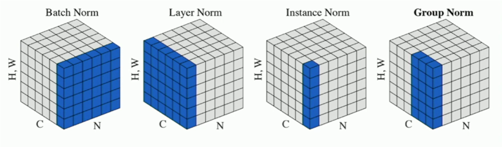

### 1. 5 components of a convolutional neural network:
Detailed calculation formula of input/output shapes between layers are in Formula.pdf
$\color{yellow}\text{M: Cap(-like) Flying Object}$
1. Convolutional Layer: Feature extraction.
2. Activation Function: Introduce non-linearity. A NN without it is a linear classifier.
3. Pooling Layer: Downsample feature maps.
4. Fully Connected Layer: Combine features for decision-making.
5. Normalization: normalize the output so that they have 0 mean and unit variance. This can reduce internal covariate shift to improve the optimization.
   
     Detailed batch normalization view CNN components.pdf

