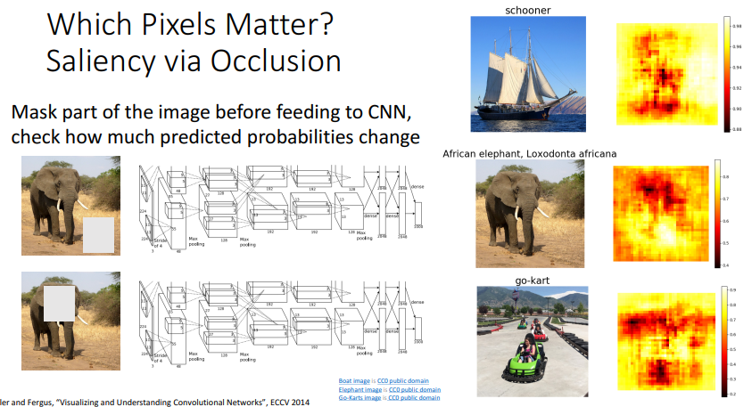
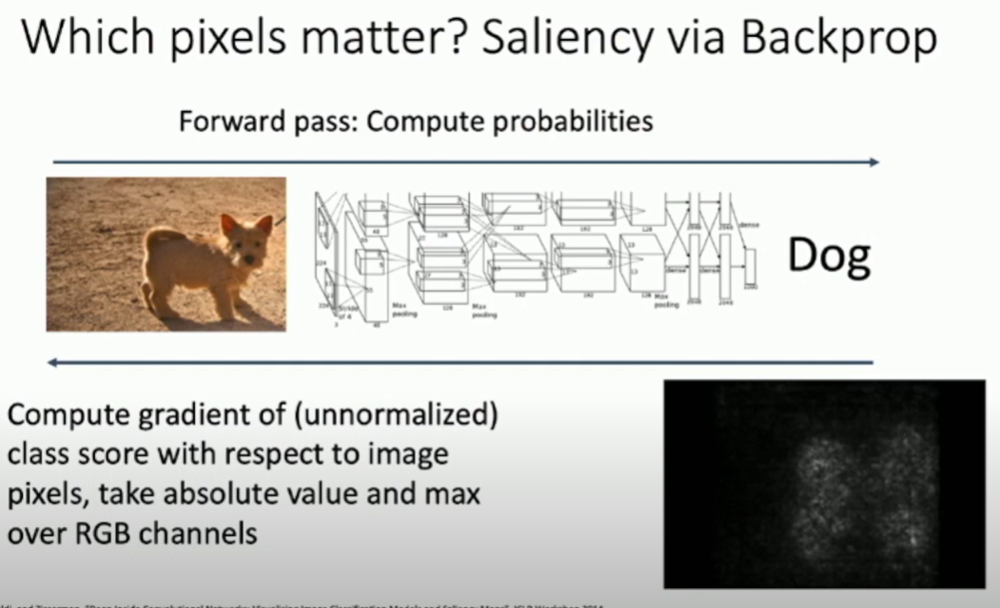
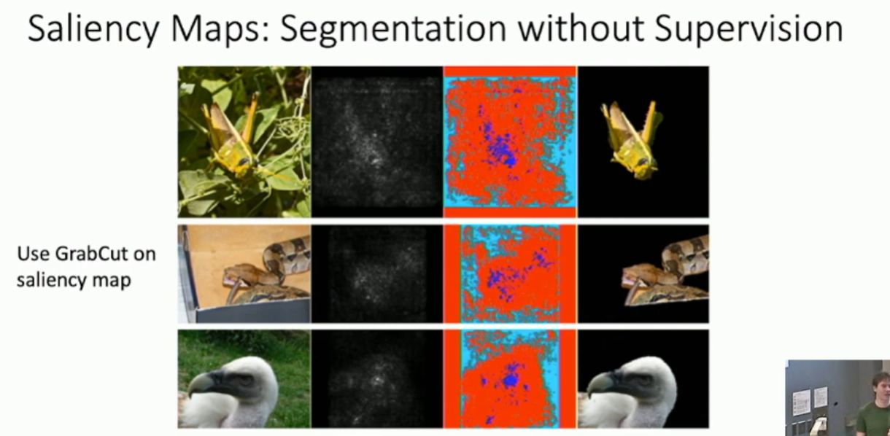
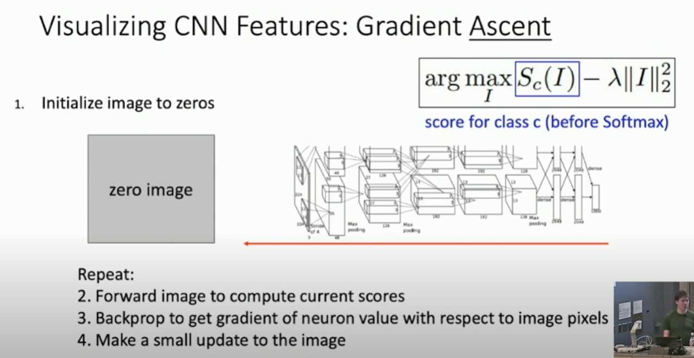
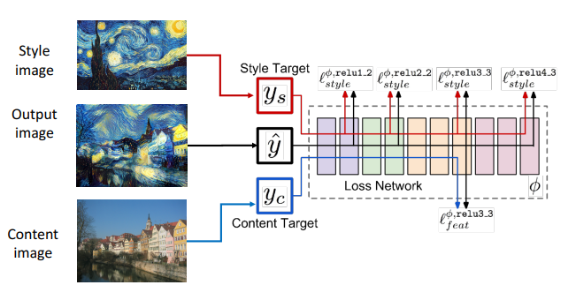
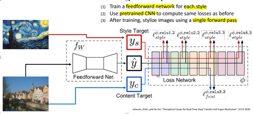
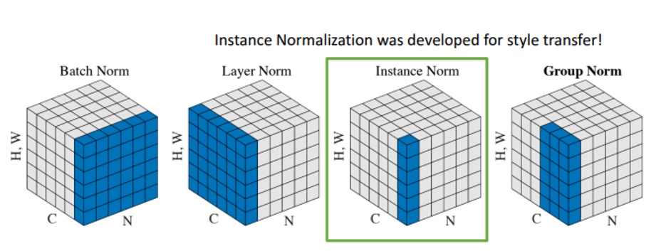

# Understanding CNN Representations
Usually, the first layer across different architectures of CNN seeks to learn edges and colors.
However, deep layers learns more complex features in high dimensions which are hard to visualize.
We can visualize filters at higher layers but not interesting.

## 1. **Activations**
The activation refers to the **output of a specific neuron** (or channel) after processing the input through the network. 
This output is the result of applying a series of operations, such as convolutions, non-linearities (e.g., ReLU), 
and pooling, on the input image or feature map.

- **Nearest Neighbors**: fc 
  - Use L2 distance in the feature space to find similar images based on the final fully connected layer (e.g., FC7).
    - Activations from a specific layer of the CNN (often the final fully connected layer, e.g., FC7 in AlexNet) are extracted for a dataset of images.
    - These activaStions are treated as feature vectors representing each image in a high-dimensional space.
  - To find the nearest neighbors for a given image, the activation vector of that image is compared with others in the dataset using a similarity metric (e.g., Euclidean distance or cosine similarity).

- **Dimensionality Reduction**: (PCA (Principal Component Analysis) or t-SNE.)
  - High-dimensional activations from a CNN layer (e.g., 4096-dimensional vectors from FC7) are collected across many images.
  - Dimensionality reduction techniques((PCA) or t-SNE), reduce these activations to a lower-dimensional space (e.g., 2D or 3D).
  - The resulting low-dimensional representations are plotted, revealing clusters or patterns that correspond to semantic groupings in the original data.

- **Maximal Patches**:
  - Identify the most activating image patches for specific neurons or channels in intermediate feature maps.
  - Run many images through the network.
  - Visualize image patches	that correspond to maximal activations (identifying the input patterns or image regions that lead to the **highest output** value for a specific neuron.).

- **Occlusion Sensitivity**:
  - Mask portions of the input image systematically and observe the effect on the network's predictions.
  - Identify critical image regions that influence the prediction.
  
  e.g. The prob of pred elephant decreased (red) when masking the elephant, so the neural network is looking at the correct place.

## 2. **Gradients**
- **Saliency (显著性) Maps**:
  - Use backpropagation to compute the gradient of the class score with respect to image pixels.
  - Highlight important regions in the image for the target class.
  
  可以根据这个显著图，去无监督的分割出图像中的对象.然后我们就可以使用训练好的网络，来以某种方式实现对输入图像中与对象类别对应的部分的分割操作[2]
  
  
- **Intermediate(中期) features via guided backprop**: Find the part of an image that a neuron responds to.
  - 1.Select a feature map in an intermediate layer
  - 2.Pass an input image through the CNN to compute activations for all layers, including the selected intermediate layer.
  - 3.Compute the gradient of the selected neuron or channel's activation with respect to the input image.
     This gradient indicates how changes in the input image would affect the activation of the selected feature.
  - 4.Modify the backpropagation algorithm by allowing only positive gradients to pass back through ReLU layers.
    - During backpropagation, set the gradient to zero for any neurons that had a negative gradient or a negative activation in the forward pass.
    - This ensures that only features that positively contribute to the activation are highlighted.
  - 5.Use the computed gradients to create a "saliency map" that highlights the regions of the input image most relevant to the selected feature.

- **Class Visualization**:
  - Generate synthetic(合成的) images through gradient ascent(上升) 
    - Gradient Ascent: 
      - to maximize a function. 
      - It iteratively adjusts the parameters in the direction that increases the value of the objective function (e.g., reward function).
  - Regularize these images to ensure they remain interpretable.
    - simple regularizer, penalize L2 norm of generated image
    - better regularizer: penalize L2 norm of generated image, also during optimization periodically. -> more realistic picture.
    

- **Adversarial(对抗性的) Examples**:
  - Slightly perturb(扰乱) the image to maximize the score for an incorrect class.
  - Expose vulnerabilities in the network's decision-making process.
  - alg:
    - 1.Start from an arbitrary image 
    - 2.Pick an arbitrary category
    - 3.Modify the img via gradiend ascent to maximize the class score
    - 4.Stop when the network is fooled.
    
- **Feature Inversion**:
  - Reconstruct input images from feature vectors or activations at different layers.
  - Use regularization methods (e.g., Total Variation) to maintain natural appearance in the reconstructions.
  -  It can be used to evaluate the importance of feature maps, and to prune the least important ones for network compression

## 3. **Fun Applications**
- **DeepDream**:
  - Enhance the features of an existing image by iteratively amplifying activations at specific layers.
  - Employ tricks like jittering and multiscale processing to create fractal-like patterns.
  - alg:
    - 1. Forward: compute activations at chosen layer 
    - 2. Set gradient of chosen layer equal to its activation 
    - 3. Backward: Compute gradient on image 
    - 4. Update image
    
- **Style Transfer**:
  - Combine features from a content image and style statistics (Gram matrices) from a style image.
  - Optimize a new image to match both content and style characteristics.
  - Match features from content image and Gram matrices from style image 
  - Resizing style image before running style transfer algorithm can transfer different types of features 
  - Mix style from multiple images by taking a weighted average of Gram matrices
  
  - Fast Neural Style Transfer: solve the probl: many forward/backward passes through VGG:
  
  - Replacing batch normalization with instance normalization improves results.
  
- **Texture Synthesis**:
  - Generate larger textures from small patches using Gram matrices to capture feature statistics.
  - Employ iterative optimization with pre-trained networks (e.g., VGG).

## 4. **Advanced Visualization Techniques**
- **Guided Backpropagation**:
  - Compute gradients while suppressing negative influences through ReLU, leading to more refined visualizations.

- **Multi-Faceted Feature Visualization**:
  - Visualize multiple aspects of a single neuron using advanced optimization and regularization methods.
  - Discover diverse features learned by each neuron in deep layers.

## 5. **Implementation Insights**
- Regularization Techniques:
  - Use Gaussian blurring, gradient clipping, and center bias during optimization.
- Tools:
  - Pre-trained CNNs (e.g., AlexNet, ResNet, VGG) and libraries like ConvNetJS are useful for these tasks.
- Applications:
  - Analyze what different layers and neurons are learning, improve interpretability, and create visually appealing outputs.

## Gram matrix
选择的特征表示通常是一个形状为(C, H, W)的三维张量，其中C是通道数量，H和W分别是特征图的高和宽。为了计算格拉姆矩阵，你首先需要将这个3D张量转换为一个2D矩阵，形状为(C, H*W)，你可以通过reshape或flatten操作来实现这一步。然后，你计算这个2D矩阵与其自身的转置的乘积，得到的就是格拉姆矩阵，其形状为(C, C)。每个元素都是相应两个通道的特征向量的内积，可以被理解为这两个特征在图像中的相关性或共现度。

如果你从特征图中抽取两个C维向量并计算它们的格拉姆矩阵，实际上你就在计算这两个向量的外积。这种方法常常被用来衡量两个向量之间的关系。

这样的话，格拉姆矩阵的元素是两个向量的内积，可以表示这两个向量之间的相关性。如果你将特征图中的每个位置看作一个独立的样本，那么这个格拉姆矩阵就可以看作这两个向量在所有样本上的协方差矩阵。这个协方差矩阵可以提供关于这两个向量分布和关系的信息。

例如，如果你正在处理图像，并且你的向量是来自卷积层的特征图，那么这个协方差矩阵就可以捕捉到图像中的纹理信息。在这种情况下，每个元素的值都表示了相应的两个特征通道在图像的空间布局中的相关性。

因此，计算特征图中两个C维向量的格拉姆矩阵可以帮助你理解这两个向量的关系，以及它们在数据中的分布和交互。这对于理解你的模型，以及设计新的模型和算法都是有用的。
## References
1. https://www.youtube.com/watch?v=G1hGwHVykDU&t=1383s
[2] https://github.com/Michael-Jetson/ML_DL_CV_with_pytorch/blob/main/ComputerVision/Lecture14_Visualizing_and_Understanding.md