### 1. Recurrent Neural Networks (RNNs) and Their Trade-offs
- **Advantages**:
  - Can process sequences of arbitrary length.
  - Shares weights across time, making it parameter-efficient.
- **Disadvantages**:
  - Sequential processing leads to slow computation.
  - Struggles with long-term dependencies due to vanishing gradients.

### 2. seq2seq Task
#### 2.1 only RNNs
Problem: The encoder compresses the entire input sequence into a single fixed-size vector (the final hidden state of the encoder).
  This vector serves as the sole context for the decoder to generate the output sequence.For long input sequences, this fixed-size vector often fails to capture all relevant information, leading to loss of critical details.
Decoders struggle to generate accurate outputs for longer or more complex sequences.
#### 2.2 RNN + **Attention**
- Attention addresses the bottleneck of fixed-size context vectors by allowing the decoder to focus on specific parts of the input sequence dynamically.
- **Key Features**:
  - **Alignment Scores** 
  - **Context Vector** 
  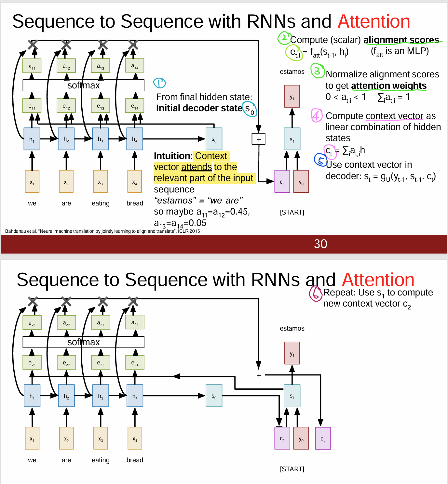
  - different context vector in each timestep of decoder
  - Input sequence not bottlenecked through single vector
  - At each timestep of decoder, context vector “looks at” different parts of the input sequence

### 3. Image Captioning Task
#### 3.1 RNN + **Attention**
  New context vector at every time step. Each context vector will attend to different image regions.
  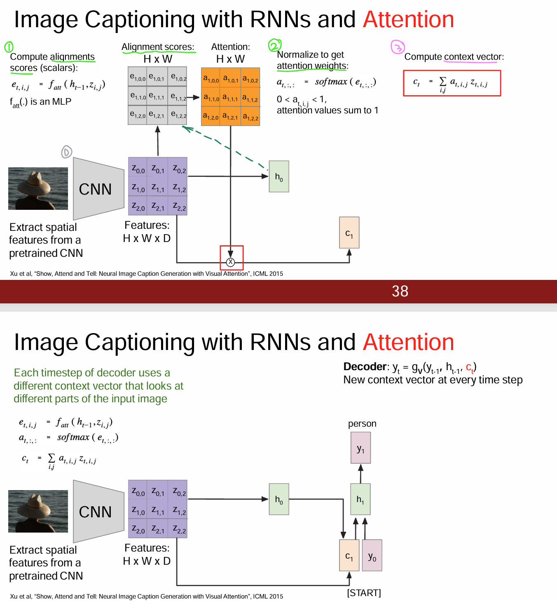
This entire process is differentiable. 
Model chooses its own attention weights, no attention supervision is required.

### 4. General att. V.S. Self att.
| **Aspect**                          | **General Attention Layer**                              | **Self-Attention Layer**                                   |
|-------------------------------------|----------------------------------------------------------|------------------------------------------------------------|
| **Purpose,focuses on relationship** | between two sets of vectors (e.g., encoder-decoder).     | within the same sequence.                                  |
| **Inputs**                          | Query (decoder), Keys and Values (encoder).              | Query, Key, and Value are all derived from the same input. |
| **Context Vector**                  | information from the external input sequence.            |relationships among tokens in the same sequence.           |
| **Usage**                           | Used in encoder-decoder attention for seq2seq tasks.     | Core of self-contained models like Transformers.           |
| **Applications**                    | Machine translation, image captioning, multimodal tasks. | Language modeling, text generation, image processing.      |
| **Complexity**                      | Depends on the sizes of the query and key-value sets.    | Scales quadratically with sequence length.                 |

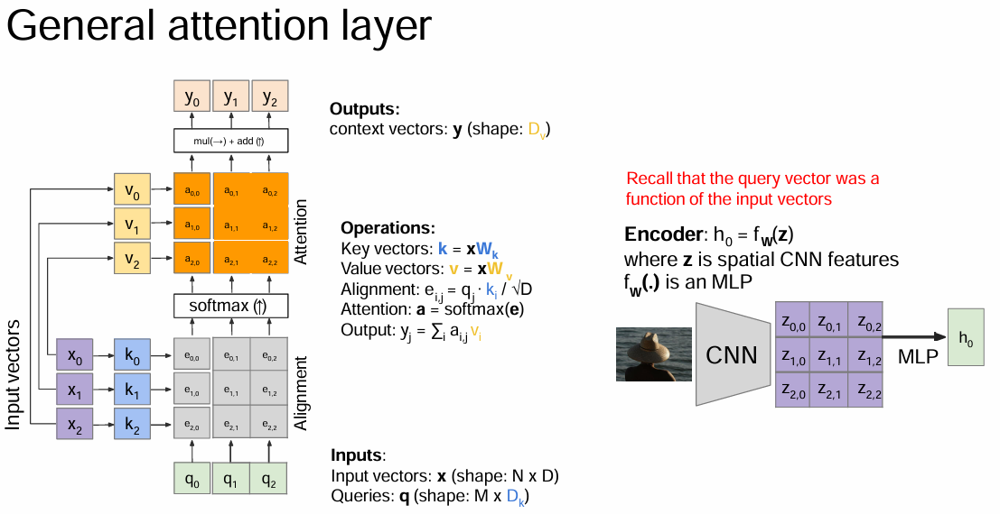
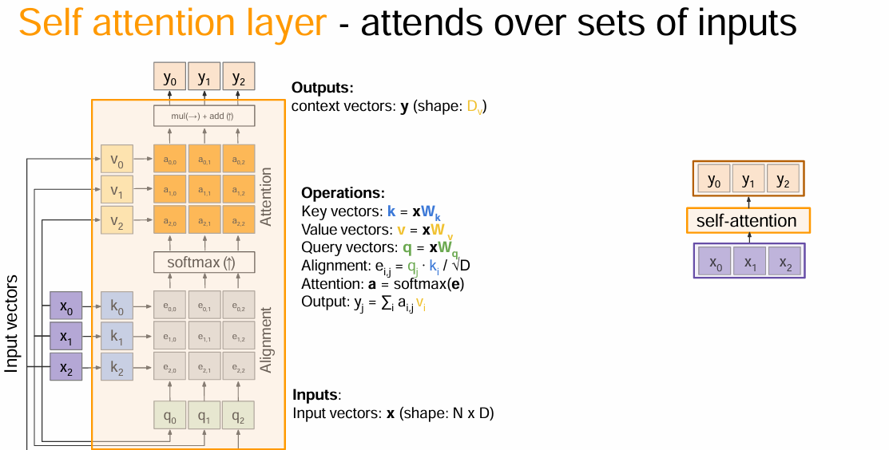
Self-attention layer doesn’t care about the orders of the inputs!
- Problem: How to encode ordered sequences like language adn spatially ordered img features?
- Solution: Positional encoding
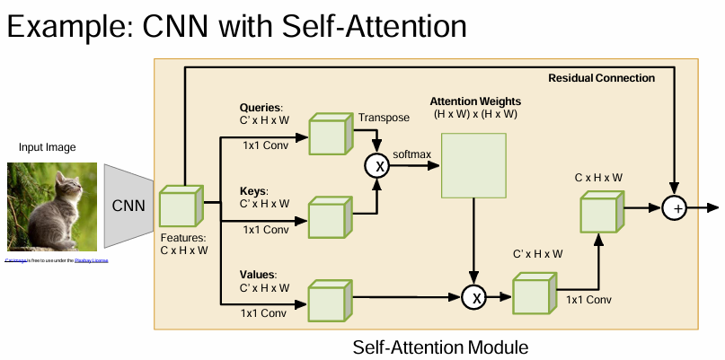

### 5. Transformers
1. Introduced in **"Attention Is All You Need" (Vaswani et al., 2017)**.
2.  Transformers are a type of layer that uses self-attention and 
layer norm.
 ○ It is highly scalable and highly parallelizable
 ○ Faster training, larger models, better performance across vision and language tasks
3. Key Innovations: multi-head att self-att, positional encoding, masked att.
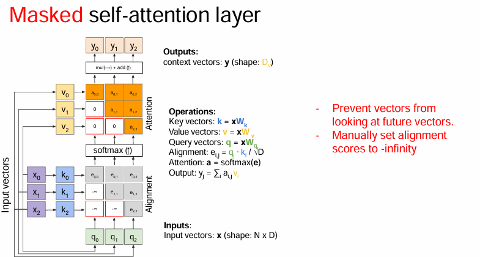
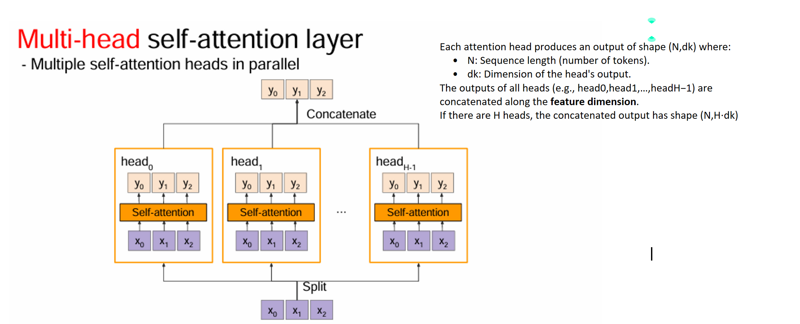
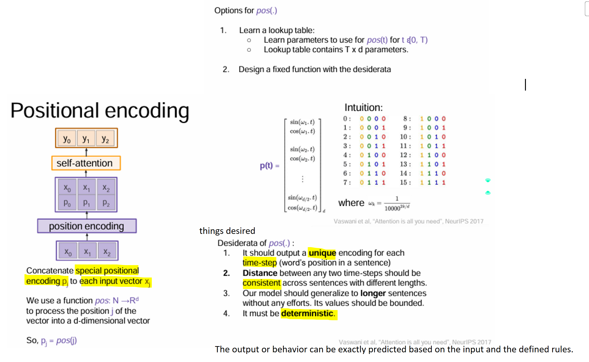
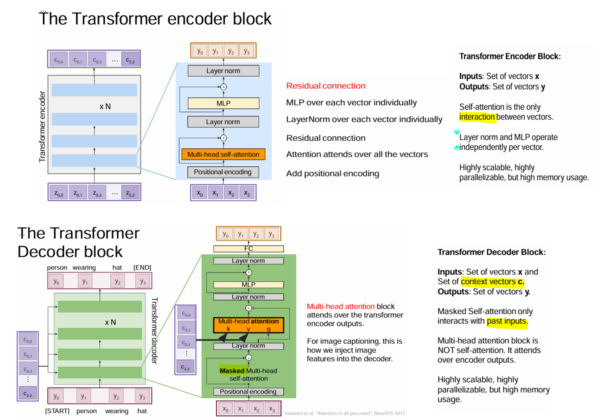
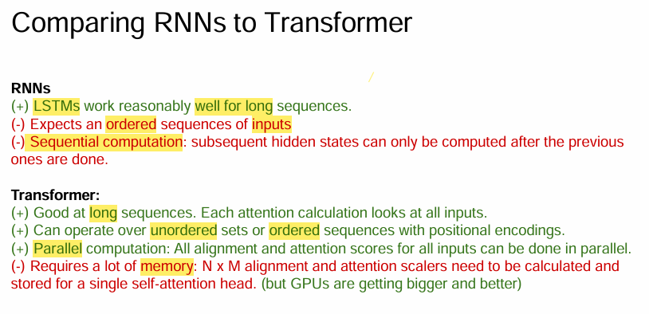

### 6. Vision Transformers (ViTs)
- Adapt Transformers for image processing.
- Split images into patches (e.g., \(16 \times 16\)) and treat each patch as a sequence token.
- Pretrained on large-scale image datasets, demonstrating competitive performance with CNNs.
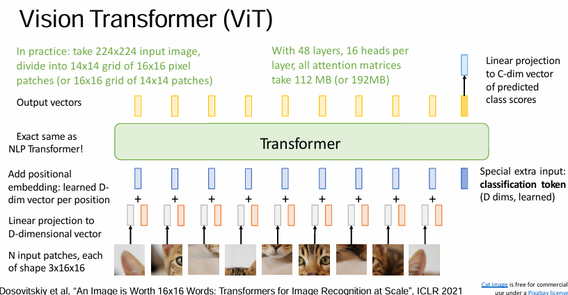
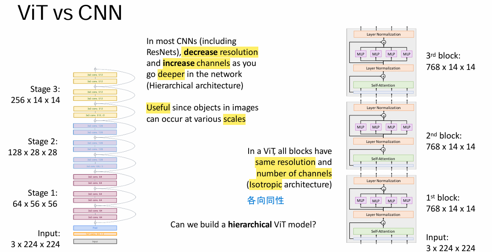
#### 6.1 Hierarchical ViT: 
MViT, Improved MViT, Swin (Swin Transformer: shifted window attention)
Swin:
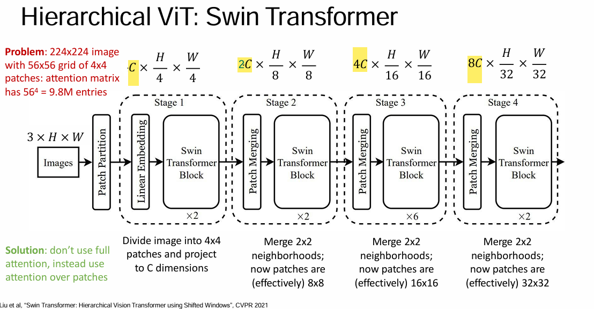
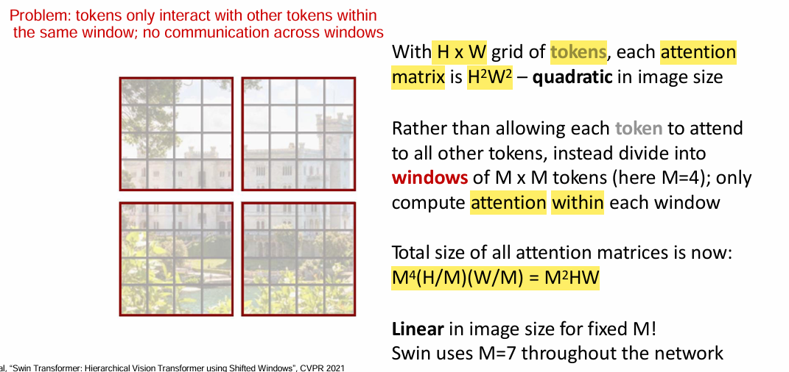
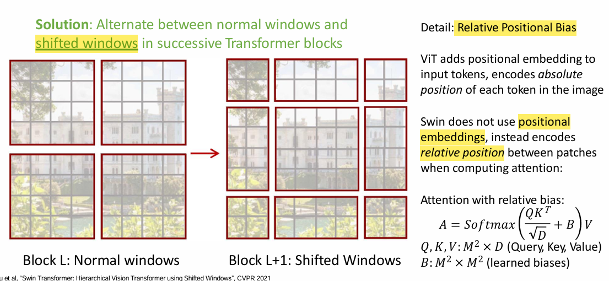

### 7. Obj detection with Transformers: DETR
 Simple object detection pipeline: directly output a set of boxes from a Transformer
 Noanchors, no regression of box transforms
 Match predicted boxes to GT boxes with bipartite matching; train to regress box coordinates
 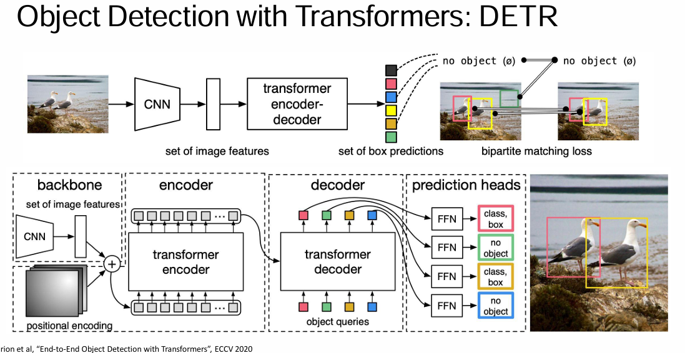
Architecture of DETR:
1. Backbone (Feature Extraction):
A CNN (e.g., ResNet) is used as a backbone to extract feature maps from the input image.
2. Transformer Encoder:
Processes the flattened feature maps and encodes the global context of the image.
3. Transformer Decoder:
Takes learned positional embeddings (object queries) and interacts with the encoder outputs to predict objects.
4. Prediction Heads:
- Each decoder output predicts:
  - Class label: The category of the object.
  - Bounding box: The coordinates of the object's location, represented as normalized values.

+: 
1. End-to-End Training: Removes the need for complex heuristics like anchors, proposals, or NMS.
2. Global context:transformer captures global relationships in the image
3. flexibility: easily extended to other tasks like panoptic (全景式) segmentation.

-:
1. Slow Convergence
2. High Computational Cost
3. Localization Precision: Bounding box regression can sometimes be less precise compared to traditional methods.

### References
https://cs231n.stanford.edu/slides/2022/lecture_10_ruohan.pdf
https://cs231n.stanford.edu/slides/2022/lecture_11_ruohan.pdf