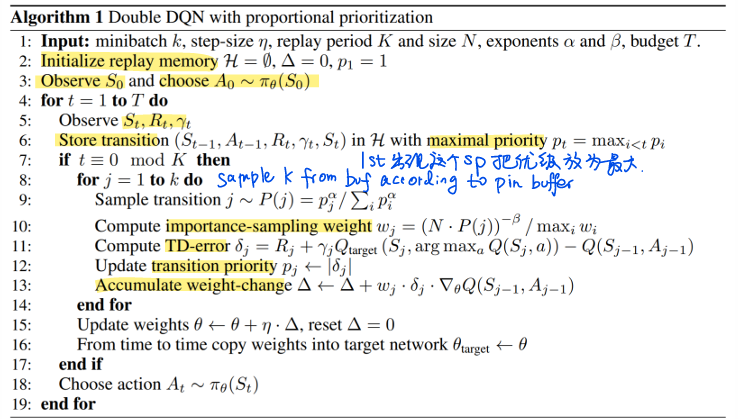

# Summary of Notation

1. Capital letters: random variables
2. Lowercase letters: values of random variables & for scalar functions.
3. **Quantities** that are required to be real-valued vectors are written in **bold** and in **lowercase** (even if random variables). Matrices are bold capitals.
4. Abbreviations: - for disadvantages, + for advantages, sol for solution, nw for network

## Symbols

- $\overset{.}{=}$: equality relationship that is true by definition
- $\approx$: approximately equal
- $\propto$: proportional to
- $Pr\{X = x\}$: probability that a random variable $X$ takes on the value $x$
- $X \sim p$: random variable $X$ selected from distribution $p(x)$
- $E[X]$: expectation of a random variable $X$, i.e.,
  $E[X] \overset{.}{=} \sum_x p(x)x$
- $\arg\max_{a} f(a)$: a value of $a$ at which $f(a)$ takes its maximal value
- $\ln x$: natural logarithm of $x$
- $e^x$: the base of the natural logarithm, $e \approx 2.71828$, carried to power $x$; $e^{\ln x} = x$
- $\mathbb{R}$: set of real numbers
- $f: X \to Y$: function $f$ from elements of set $ X $ to elements of set $ Y $
- $(a, b]$: the real interval between $a$ and $b$ including $b$ but not including $a$

## Parameters

- $\epsilon$: probability of taking a random action in an $ \epsilon $-greedy policy
- $\alpha, \beta$: step-size parameters
- $\gamma$: discount-rate parameter
- $\lambda$: decay-rate parameter for eligibility traces
- $\mathbb{1}_\text{predicate}$:  indicator function. = 1 if the predicate is true, else 0.

# 1 Introduction

# 2 Multi-Armed Bandit Problem

- $k$: number of actions (arms)
- $t$: discrete time step or play number
- $q_*(a)$: true value (expected reward) of action $ a $
- $Q_t(a)$: estimate at time $ t $ of $ q_*(a) $
- $N_t(a)$: number of times action $ a $ has been selected up to time $ t $
- $H_t(a)$: learned preference for selecting action $ a $ at time $ t $
- $\pi_t(a)$: probability of selecting action $ a $ at time $ t $
- $\bar{R}_t$: estimate at time $ t $ of the expected reward given $ \pi_t $

# 3 Markov Decision Process

TODO: 寻找最优pi的方法。
The reinforcement learning agent and its environment interact over a sequence of discrete time steps. Everything inside the agent is completely known and controllable by the agent; everything outside is incompletely controllable but may or may not be completely known.The agent’s objective is to maximize the amount of reward it receives over time.

**Markov Process** is a stochastic process with Markov property:  The future is independent of the past given the present.

- $t$: discrete time step.
- $\color{turquoise}\text{s, s' : current state, next state}$,  $\color{turquoise}\text{basis for making the choices}$
- $a$: an action made my the agent
- $\color{turquoise}\text{ r} $: a reward, $\color{turquoise}\text{basis for evaluating the choices}$
- $S$: set of all nonterminal states
- $S^+$: set of all states, including the **terminal state**
- $A(s)$: set of all actions available in state $ s $
- $R$: set of all possible rewards, a finite subset of $ \mathbb{R} $
- $\rho \subseteq \mathbb{R}$: subset of $ \mathbb{R} $
- $|S|$: number of elements in set $ S $
- $T, T(t)$ final time step of an episode; the episode including time step t.
- $A(t)$ : Action at t
- $S(t)$ : state at t
- $R(t)$ : reward at t
- $\color{turquoise} \pi  $ : policy (stochastic decision-making rule),is a $\color{turquoise}\text{mapping from states to actions}$
- $\pi(s)$ : action taken in state s under deterministic policy $\pi$
- $\pi(a|s)$ : <mark> probability </mark> of taking action a in state s under stochastic policy $\pi$

$\color{yellow}\text{Markov Decision Process (MDP)}$ is a mathematical framework used to describe an environment in decision-making scenarios where outcomes are partly random and partly under the control of a decision-maker.

$$
P[S_\text{t+1}=P[S_\text{t+1}|S_1,...,S_t]\\P[S_\text{t+1}|S_t,A_t]
$$

$\color{orange}\text{Finite Markov dynamics:}$ probability of transition to state $ s' $ with reward $ r $, from state $ s $ and action $ a $

$$
p(s', r | s, a)= Pr\{S_t=s', R_t=r | S_\text{t-1}=s, A_\text{t-1}=a\}
$$

$$
\sum_{s'\in S} \sum_{r\in R} p(s', r | s, a)=1, \text{for all s} \in S, a \in A(s)
$$

- $p(s' | s, a)$: **state**-transition prob. probability of transition to state  $s'$, from state $s$ taking action $a$
- $r(s, a)$: expected immediate reward from state $s$ after action $a$. 从上个状态采取行动后的即时回报

  $$
  r(s,a) = E[R_t| S_\text{t-1}=s, A_\text{t-1}=a]=\sum_{r\in R}r\sum_{s'\in S}p(s',r|s,a)
  $$
- $r(s, a, s')$: expected immediate reward on transition from $ s $ to $ s' $ under action $ a. $ 在行动a下，两个状态转化的即时回报

  $$
  r(s,a,s') = E[R_t| S_\text{t-1}=s, A_\text{t-1}=a, S_t=s']=\sum_{r\in R}r \frac{p(s',r|s,a)}{p(s'|s,a)}
  $$

$\color{orange}\text{Expected return }G_t$

- function of future rewards, long term, that the agent seeks to maximize (in expected value).
- undiscounted formula: $G_t= R_\text{t+1}+R_\text{t+2}+R_\text{t+3}+...+R_\text{T}$ appropriate for episodic tasks (interaction does not naturally break into episodes but continues without limit.)
- discounted formula: $G_t= R_\text{t+1}+\gamma R_\text{t+2}+\gamma^2R_\text{t+3}+...+R_\text{T}=\sum_{k=0}^{\infty} \gamma^kR_\text{t+k+1}=R_\text{t+1}+\gamma G_\text{t+1}$, appropriate for continuing tasks (Xbreaks into episode, continue without limitation).
  - Note that although the return is a sum of an infinite number of terms, it is still finite if the reward is nonzero and constant—if < 1. For example, if the reward is a constant +1
    $$
    G_t=\sum_{k=0}^{\infty} \gamma^kR_\text{t+k+1}=\sum_{k=0}^{\infty}\gamma^k = \frac{1}{1-\gamma}
    $$

$\color {yellow} G_t \text{ Def in lecture } $$G_t=R_t+\gamma R_\text{t+1}+\gamma^2R_\text{t+2}+...=\sum_{k=0}^{\infty}\gamma^kR_\text{t+k} $

$\color {orange}\pi \text{'s Value Functions}$ assign values to: s, (s,a), exp return from that sate, (s,a)|$\pi$

- $v_\pi(s)$: value of state $s$ under policy $\pi$ (expected return)
- $v_*(s)$: value of state $s$ under the **optimal policy** (its value functions are optimal).
  - optimal value f for s & (s,a) are unique for a MDP, but there can be many optimal $\pi$
  - Any policy that is greedy with respect to  the optimal value functions must be an optimal policy.
- $q_\pi(s, a)$: value of taking action $a$ in state $s$ while following policy $\pi$
- $q_*(s, a)$: value of taking action $a$ in state $s$ while following the optimal policy
  ```
  q statnds for quality, distinguised from state-value f
  ```

$\color{orange}\text{Bellman equation for state values } v_\pi$ The value function $v_\pi$ s Bellman equation.


```text
Starting from state s, the root node at the top, the agent could take any of some set of actions (e.g.3) based on its policy pi. 
From each of these, the environment could respond with one of several next states, s0 (e.g.2), 
along with a reward, r, depending on its dynamics given by the function p.
```

$$
v_\pi(s)=E_\pi[G_t|s]
=E_\pi[R_\text{t+1}+\gamma G_\text{t+1}|S=s]
=\sum_a\pi(a|s)\sum_\text{s',r}p(s',r|s,a)[r+\gamma v_\pi(s')] \text{   for all s} \in S
$$


```text
If we were to take action 𝑎 in state 𝑠, what is the expected return if we then follow 𝜋 afterward?
```

$$
q_\pi(s,a)
=E_\pi[G_t|s,a]
=E_\pi[R_\text{t+1}+\gamma G_\text{t+1}|S=s, A=a]
=\sum_rp(s',r|s,a)[r+\gamma v_\pi(s')]\sum_\text{s',a}\pi(a'|s')
$$

$\color{orange}\text{Bellman optimality equation}$ :the value of a state under an optimal policy must equal the expected return for  the best action from that state

$$
v_*(s)=\max_a q\pi_*(s,a) 
=E_\pi[G_t|s]
=E_\pi[R_\text{t+1}+\gamma G_\text{t+1}|S=s]
=\sum_a\pi(a|s)\sum_\text{s',r}p(s',r|s,a)[r+\gamma v_\pi(s')]
$$

$\color{orange}\text{Apporximations for value f, policy, models}$

Even if the agent has a complete and accurate environment model, the agent is typically unable to perform enough computation (memory) per time step to fully use it.

# 4 Model-free method

2 methods:
MC: 从头到尾全部episode 采样完了才更新
TD  只采样一部就更新

# 5 Multi-step bootsr

折中4, 采样几步就更新几次，剩下的值函数估计

# 6 Value-based DRL

这一讲终于跳脱出了前面传统的强化学习（解决相对简单的问题），用神经网络拟合Q, V函数，适用于更大的状态空间。

$\large \color{violet}\text{DQN family}$

Q-Learning: learns a function $Q_\theta(s,a)$ with para $\theta$

- given a segment {(s,a,s',r)}
- $\color{turquoise}\text{target }$ $y=r+\gamma max_\text{a'}Q_\theta(s',a')$
- update:

  $$
  Q_\theta(s,a) \leftarrow Q_\theta(s,a)+\alpha(r+\gamma \max\limits_{a'}Q_\theta(s',a')-Q_\theta(s,a))
  $$

  α后面类似梯度下降
- optimization objective:

  $$
  \theta^* \leftarrow arg \min_\theta E_\text{(s,a,s',r) ∼ U(D)} \frac{1}{2}[(r+\gamma \max\limits_{a'}Q_\theta(s',a'))-Q_\theta(s,a)]^2
  $$

  - $(r+\gamma max_\text{a'}Q_\theta(s',a')$ TD target, no gradient here???
  - $\text{(s,a,s',r) ∼ U(D)}$: a transition **(state, action, next state, reward)** is **randomly sampled** from the replay buffer D using a **uniform distribution** **U**.
  - $Q_\theta(s',a')$ 如果不固定，会连续更新，不稳定

$\color{orange}\text{Deep Q-Networks (DQN)}$ represents Q function $Q_\theta(s,a)$ by using neural networks.

- Input:s.   Not（s,a), because too large
- Last layer: a.  #of elements $|A|$
- Output:(s,a)

-:

- unstable
  - continuously sampled (s,a,s',r) is not IID
  - $Q_\theta(s',a')$ updates freq
- output is discrete (only fit for discrete action space)

sol:

- Experience replay: non IID data -> IID data
  - Store sample $e_t = (s_t, a_t, s_\text{t+1}, r_t)$ in each step of training INTO replay buffer D.
  - Sampling, uniformly distributed
- Build 2 nw:
  - Evaluations nw: $Q_\theta(s,a)$
  - Target nw $Q_{\theta^-}(s,a)$ to compute TD target: synchronize with the evaluation nw every C step

    - $\color{turquoise}\text{target }$ $y=r+\gamma \max\limits_{a'} Q_{\theta^-}(s',a')$

**Algorithm:**

1. Randomly initialize evaluation network $\theta; \theta^- \leftarrow \theta$
2. Initialize experience replay buffer D
3. Repeat until convergence{

- Get initial state $s_0$
- For each step t=0,1,...,T

  - take action $a_t$ by $\epsilon$-greedy based on $Q_\theta$
  - Get reward $r_t$ and the next state $s_{t+1}$
  - Store ($s_t, a_t, s_{t+1}, r_t$) in D
  - If D is large enough, sampling N samples $\{(s_t, a_t, s_{t+1}, r_t)\}^N_{i=1}$
  - For each sample, calculate target $y_i =r_i+ \gamma \max\limits_{a'} Q_{\theta^-}(s_{i+1},a')$
  - Update $\theta$ by minimize loss $L = \frac{1}{2N}\sum_i(y_i-Q_\theta(s_i,a_i))^2$
  - If t mod C=0, then update $\theta^- \leftarrow \theta$
    }

$\color{orange}\text{Double DQN (DDQN)}$,improved version of DQN

Due to the Jensen's inequality, max operation makes the est Q always larger than real Q value. And it will be more serious when #candidate actions increase.

$$
E[\hat Q(s,a)]=Q(s,a) \\E[\max\limits_{a} \hat Q(s,a)] \ge \max\limits_{a} Q(s,a)
$$

$$
\max\limits_{a'}Q_{\theta^-}(s',a')=Q_{\theta^{-}}(s', arg \max\limits_{a'}Q_{\theta^-}(s',a')) \\=E[R|s', arg \max\limits_{a'}Q_{\theta^-}(s',a'),{\theta^-}] \\ \ge \max(E[R|s', a_1,{\theta^-}], E[R|s', a_2,{\theta^-}],...  a_i \in A
$$

$$
\text{Where } E[\max(X_1, X_2)] \ge \max(E[X_1], E[X_2])
$$

In DDQN, $Q_\theta$ is used to select next action.


$\color{pink}\text{Prioritized Experience Replay}$ : find more experience samples

Calculate the priority $p_t$ (value of learning)

$$
p_t = |r_t + \gamma Q_{\theta^-}(s_{t+1}, arg \max\limits_{a'}Q_\theta(s_\text{t+1},a'))-Q_\theta(s_t,a_t)|
$$

Store experience $e_t = (s_t, a_t,s_\text{t+1},r_t, p_t+\epsilon)$ , $\epsilon$ is the noise for randomness, in replay buffer to give each sample a chance to be sampled.

Prob of $e_t$ being selected is $P(t)=(p_t^\alpha)/(\sum_kp_k^\alpha)$. α for smoothing. (=0 in uniform sampling)

Weight in importance sampling $w_t=(N\times P(t))^{-\beta}/(\max\limits_{i} w_i)$



$\color{orange}\text{Dueling DQN}$, improved version of DQN. parallel with DDQN

Inputs of s are processed by CNN to extract features.

Core:Advantage funciton A

$$
A^\pi(s,a)=Q^\pi(s,a)-V^\pi(s)\\Q^\pi(s,a)=E[G_t|s,a]\\V^\pi(s)=E_{a  ∼ \pi(·|s)}[Q^\pi(s,a)]
$$

$V^\pi(s) \text{ is the avagerage value of }Q^\pi(s,a)\text{. }A^\pi(s,a) \text{ measures the effect after taking an action.}$

To obtain V, A separately (fc layer), Q in the DQN is decomposed. And they are combined into Q finally. *Subscript denotes parameters.*

$$
Q_{\theta,\alpha,\beta}(s,a) = V_{\theta,\alpha}(s)+A_{\theta,\beta}(s,a)
$$

However, this version is unstable in training because the non-uniqueness in modeling V and A.

For sol 1, max two sides of Q=V+A (max limits a only operates the f with para a), define the optimal A function($\max\limits_aA(s,a)-\max\limits_aA(s,a)$) equals to 0.

$$
Q(s,a)=V(s)+A(s,a) \\ \max\limits_aQ(s,a)=V(s)+\max\limits_aA(s,a)-\max\limits_aA(s,a)\\V(s)=\max\limits_aQ(s,a)
$$

So is the sol 2.

Therefore the two sols:

1.Set $V_{\theta,\alpha}(s)=\max\limits_{a'}Q_{\theta,\alpha,\beta}(s,a')$

$$
Q_{\theta,\alpha,\beta}(s,a) = V_{\theta,\alpha}(s)+A_{\theta,\beta}(s,a)-\max\limits_{a'}A_{\theta,\beta}(s,a')
$$

2. Set $V_{\theta,\alpha}(s)=\frac{1}{|A|}\sum_{a' \in A}Q_{\theta,\alpha,\beta}(s,a')$

$$
Q_{\theta,\alpha,\beta}(s,a) = V_{\theta,\alpha}(s)+A_{\theta,\beta}(s,a)-\frac{1}{|A|}\sum_{a' \in A}A_{\theta,\beta}(s,a')
$$

The sol ensure the uniqueness of V function,

but not satisfy with the Bellman f, the outputs of A,V,Q of the network are no longer the real A,V,Q.

We do not care of it, because the standard of doing greedy is the order of Q. 

The relative order of Q remains the same. s.t.$Q(s,a_1) > Q(s,a_2) \rightarrow A(s,a_1) > A(s,a_2)$$

+ +:
  + Handle states that are less associated with actions. 没人的路上怎么开都行。
  + effective in learning state-value f: one state  value function corresponds to multiple Advantage. functions. Share the same state-value function; Easy Training, fast convergence.

# dft

Approximate Value Functions

- $v_\theta(s)$: approximate value of state $ s $ given parameter vector $ \theta $
- $q_\theta(s, a)$: approximate value of state-action pair $ (s, a) $ given parameter vector $ \theta $
- $\nabla v_\theta(s)$: column vector of partial derivatives of $ v_\theta(s) $ with respect to $ \theta $
- $\nabla q_\theta(s, a)$: column vector of partial derivatives of $ q_\theta(s, a) $ with respect to $ \theta $

#### Bellman Operators

- $B_\pi$: Bellman operator for value functions
- $P$: state-transition probability matrix under $ \pi $
- $D$: diagonal matrix with on-policy state distribution on its diagonal
- $X$: feature matrix, with $ x(s) $ as its rows
- $\Pi$: projection operator for value functions

## Missing Symbols and Notation

Below are the missing symbols and notation that were not properly formatted in the original document:

## Symbols

- $\mathbb{R}$: set of real numbers
- $f : X \to Y$: function $f$ from elements of set $X$ to elements of set $Y$
- $(a, b]$: the real interval between $a$ and $b$ including $b$ but not including $a$
- $\in$: is an element of; e.g., $s \in S, r \in R$
- $\subseteq$: subset of; e.g., $R \subseteq \mathbb{R}$
- $|S|$: number of elements in set $S$

## Temporal Difference Learning

- $\delta_t$: temporal-difference (TD) error at time $t$
- $\delta_t^s, \delta_t^a$: state- and action-specific forms of the TD error
- $n$: in n-step methods, $n$ is the number of steps of bootstrapping

## Eligibility Traces

- $w, w_t$: weight vector in function approximation
- $\mathbf{w}, \mathbf{w}_t$: weight vector notation
- $x(s)$: vector of features visible in state $s$
- $x(s, a)$: vector of features visible in state $s$ taking action $a$
- $\mathbf{x}(s)$, $\mathbf{x}(s, a)$: feature vectors in bold
- $\mathbf{w}^T \mathbf{x}$: inner product of weight vector and feature vector

## Policy Gradient Methods

- $\theta, \theta_t$: parameter vector of target policy
- $\pi(a | s, \theta)$: probability of taking action $a$ in state $s$ given parameter $\theta$
- $\nabla \pi(a | s, \theta)$: gradient of policy function
- $J(\theta)$: performance measure for policy $\pi_\theta$
- $\nabla J(\theta)$: gradient of performance measure
- $b(a|s)$: behavior policy used to select actions while learning about target policy $\pi$

## Importance Sampling

- $\rho_t:h$: importance sampling ratio for time $t$ through time $h$
- $\rho_t$: importance sampling ratio for time $t$ alone, $\rho_t = \rho_{t:t}$
- $r(\pi)$: average reward (reward rate) for policy $\pi$
- $\bar{R}_t$: estimate of $r(\pi)$ at time $t$

## Norms and Errors

- $\|v\|^2_{\mu}$: $\mu$-weighted squared norm of value function $v$
- $\|\delta_t\|^2$: squared temporal-difference error
- $BE(w)$: mean square Bellman error
- $PBE(w)$: mean square projected Bellman error
- $TDE(w)$: mean square temporal-difference error

# References

1. Sutton, R.,S. & Barto, A.,G. (2018). Reinforcement learning: An introduction. (2 e.d.)
2. Lecture notes by Jianxiong Guo.
