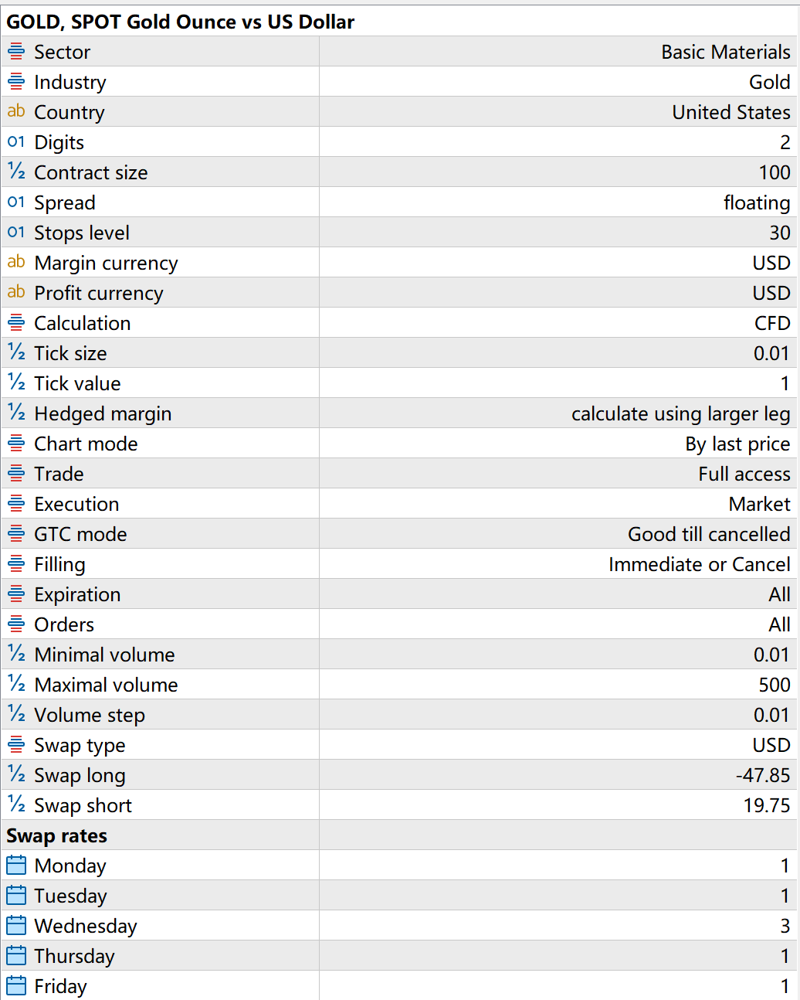
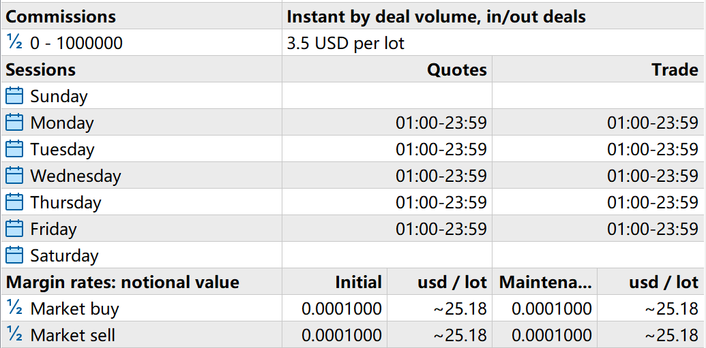
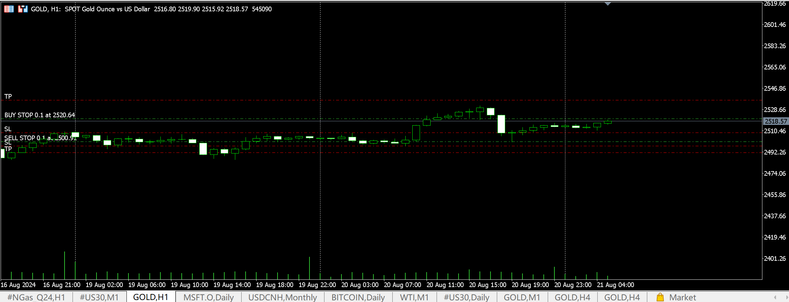
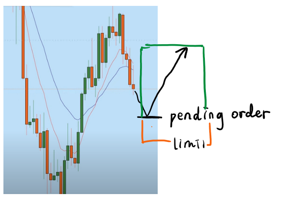
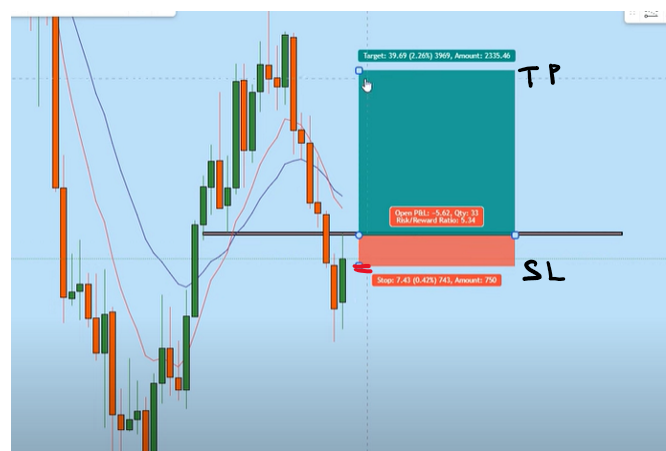
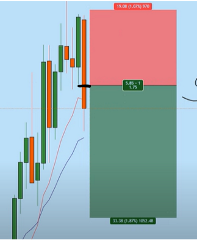

## 1 Big concepts

钱从哪来：商品价值=货币总量。社会会自我校正。
You should be focusing on your risk before your reward.

### 1.1 Trading items

1. Different markets

   1. stock market, equity. selling and buying stocks.
   2. option exchanges期权:是一种选择权，指是一种能在未来某特定时间以特定价格买入或卖出一定数量的某种特定商品的权利。
   3. interest rates market
   4. Foreign exchange
   5. credit market. insurance
   6. commodity market: gold, metals, corn, meat, futures
   7. OTC.
   8. crypto currencies
2. Asset 资产An asset is something of value of the owner.
   **Assets – Liabilities = Equity**

   > Asset: sth. of value your company owns
   > Liability: any debt your company owes others
   >
3. Security

   A security is a document that entitles the holder to some asset of another person. Almost all securities can be considered an **asset of the holder** ("securitize an asset"), but not all assets are securities.

   > 4 categories:
   >
   > - Debt securities (bonds)  债券：Bonds, Treasury bills, and certificates of deposit.
   > - Equity securities (stocks) 股票：Common stocks, preferred stocks, index funds, and ETFs.
   > - Derivative securities 衍生证券:
   >   - stock index futures(股指期货)：buy or sell the value of a specific stock index at a predetermined future date and price.
   >   - stock index options(股指期权):These are options that give the holder the right, but not the obligation, to buy or sell the value of a specific stock index at a predetermined price before or at the expiration date.
   > - Hybrid securities: convertible bonds, preferred shares, equity-linked notes(ELNs)
   >

   There are 3 options if you own a business and needing money ($1,000,000), except for getting a loan from a bank [1]:

   - **Bond**
     An investment bank helps you issue a $1,000,000 bond with a fixed interest rate. If you can't repay, creditors can *take control of your company and sell assets*. Bonds are safer than stocks because creditors have priority. Bondholders might get something back if the company goes bankrupt.
   - **Equity Security (Stock)**
     You sell 10,000 shares at $100 each, raising $1,000,000. Stockholders own part of the company but don’t get fixed interest. They might receive dividends (amout varies from y to y.). Stockholders won’t be liable beyond their investment if the company goes bankrupt. //From the market view: stock prices are det. by the value & expected performance of the company -> bid and ask behavior. The future price is uncertain. Volatility determines the amount of stock price differ from the expected value.
   - **Derivative Securities**
     These include forwards（远期）, swaps（掉期）, futures（期货）, and options（期权）, used to hedge against price changes in commodities, currencies, and interest rates.These are basically **bets on the price a commodity** (anything from milk to corn to oil to cows to stocks to bets on interest rates and currencies, etc.). Companies use these to protect themselves against future price changes. Companies like McDonald's and Southwest Airlines use derivatives to stabilize costs for inputs like beef and oil. Multinational companies use them to manage currency exchange risks.
4. stock index is not tradable. A stock index is a **statistical measure** that reflects the **composite value of a selected group of stocks**. It is used to represent the performance of a specific section of the stock market, or the market as a whole, and is often used by investors to compare the performance of their investments.
   But there are some primary tradable instruments **based on** stock indices:

   1. **Index Funds**:
      - **Mutual Funds**: These are investment funds designed to track the performance of a specific stock index. Investors can buy shares of these funds.
      - **Exchange-Traded Funds (ETFs)**: These are similar to mutual funds but are traded on stock exchanges like individual stocks.
   2. **stock index futures**: **Futures Contracts**: These are standardized contracts to buy or sell the value of a specific stock index at a predetermined future date and price. They are traded on futures exchanges.
   3. **Stock Index Options**- **Options Contracts**: These provide the right, but not the obligation, to buy (call options) or sell (put options) the value of a specific stock index at a predetermined price before or at the expiration date.
   4. index warrants:**Warrants**: These are similar to options but are typically issued by financial institutions and give the holder the right to buy or sell an index at a specified price before expiration.
   5. index CFDs(contracts for difference):**CFDs**: These are derivative products that allow traders to speculate on the price movements of a stock index without owning the underlying assets.

### 1.2 Market Players

#### 1.2.1 Primary market (一级市场)[5]

Where securities are created. Securities are purchased directly from an issuer.

Players:

1. Issuers(发行人): entities seeking to raise capital. companies, governments,...
2. Underwriters (承销商): help to price & sell the new securities: investment banks


| **Criteria**             | **Investment Banking (IB)**                                 |
| ------------------------ | ----------------------------------------------------------- |
| **Stage of Investment**  | Assists companies at various stages (e.g., IPO, M&A)        |
| **Investment Size**      | No direct investment; earns fees for services               |
| **Risk Level**           | No direct risk; focuses on advisory roles                   |
| **Investment Horizon**   | Focuses on transactions, often short-term engagements       |
| **Ownership Stake**      | No ownership; provides financial advisory services          |
| **Level of Involvement** | Advisory role, facilitating transactions                    |
| **Return Expectations**  | Fee-based, with no direct return on investments             |
| **Target Companies**     | Companies looking to raise capital, merge, or go public     |
| **Exit Strategy**        | Varies by service, including IPOs, M&A, and capital raising |

3. Investors (institutional and individual): who purchase the newly issued securities. Retail investors are less common in primary markets.


| **Criteria**             | **Angel Investors**                                   | **Venture Capital (VC)**                           | **Private Equity (PE)**                                |
| ------------------------ | ----------------------------------------------------- | -------------------------------------------------- | ------------------------------------------------------ |
| **Stage of Investment**  | Early-stage startups, often at the idea or seed stage | Early to growth-stage companies                    | Established companies, often mature businesses         |
| **Investment Size**      | Smaller amounts, typically\$10,000  to \$100,000      | Larger amounts, often\$1 million to \$100+ million | Very large amounts, can be in billions                 |
| **Risk Level**           | Very high, with a high chance of failure              | High, but with structured diligence and portfolio  | Lower than VC; targets companies with proven models    |
| **Investment Horizon**   | Short to medium-term (3-7 years)                      | Medium-term (5-10 years)                           | Medium to long-term (5-10+ years)                      |
| **Ownership Stake**      | Minority stake, often non-controlling                 | Significant minority or majority stake             | Majority or full ownership                             |
| **Level of Involvement** | Hands-on, often mentoring and guiding the startup     | Active involvement in strategic decisions          | Active in management, restructuring, or strategy       |
| **Return Expectations**  | Extremely high returns, sometimes 10x or more         | High returns, typically 3-10x on investment        | Stable returns, often focused on long-term growth      |
| **Target Companies**     | Innovative startups with high growth potential        | High-growth companies, often in tech or biotech    | Established businesses, often underperforming          |
| **Exit Strategy**        | IPO, acquisition by larger company                    | IPO, acquisition, or secondary sale                | Sale of the company, IPO, or dividend recapitalization |

Events:

1. Initial Public Offering (IPO).A process by which a private company offers its shares to the **public (general public and institutional investors)** for the first time and becomes a publicly traded company on a stock exchange.
   Impact on Ownership: Founders and early investors may dilute (make weaker) their ownership in the company as new shares are issued to the public.
2. Rights Offering:Allows a company to raise additional capital by offering more shares to its current shareholders.Shareholders are given the right to purchase additional shares at a discount to the current market price, typically on a pro-rata basis (i.e., in proportion to their existing holdings).
   Impact on Ownership: Existing shareholders can maintain their proportional ownership in the company by exercising their rights. If they choose not to participate, their ownership percentage will dilute.

E.g.
Businesses and governments that want to generate debt capital(债务资本) can choose to issue new short- and long-term bonds on the primary market. New bonds are issued with coupon rates(票面利率) that correspond to the current interest rates(利率) at the time of issuance, which may be higher or lower than pre-existing bonds.

投行岗位分布：IBD投行部(债务融资和股权发行、并购咨询)，S&T销售与交易（fixed income,equity），AM资产管理部，。。，中控风险
7月开，准备1-2年（香港）、1月开（大陆）、（5月）北美

#### 1.2.2 Secondary market (二级市场)

Where securities are traded (Investors trade among themselves). It is basically the stock market and refers to the New York Stock Exchange, the Nasdaq, and other exchanges worldwide[5].

Players [7]:

1. Market maker(做市商) :liquidity provider firms that stand ready to buy and sell stock on a regular and continuous basis at a publicly
   quoted price. Earns from spreads and commission(佣金).
2. Arbitrageurs(套利者):traders that take advantage of a price difference between two or
   more markets.
3. Speculators(投机者):take risk on purpose by betting on future movements of the security’s
   price without any logical reasons. Attempting to profit from short-term fluctuations. No risk control.
4. Hedgers(对冲): goal: protect the portfolio from losing value at the expense of
   lowering the possible benefits. Hedging.
5. Investors(投资者):allocates capital with the expectation of a future financial
   return. types: individual(through traditional/ online brokerage firms or saving accounts (part 3)/private equity,hedge funds) and institutional.

#### 1.2.3 “Third” and "fourth" markets (三、四级市场)

Deals between broker-dealers经纪自营商 and institutions through over-the-counter electronic networks and are therefore not as relevant to individual investors [5].
A broker-dealer (B-D) is a person or firm in the business of buying and selling securities for its own account or on behalf of its customers [6].

OTC:"over-the-counter" generally refers to stocks that are not trading on a stock exchange such as the Nasdaq, NYSE, or American Stock Exchange (AMEX) [5].

#### 1.2.4 Special: cryptocurrency exchange (加密货币交易所)

既当裁判又当运动员。它既是交易所，又能提供传统金融买方和卖方服务。
Centralized Exchange (CEX)中心化交易所: Binance, Huobi, OKX, Coinbase
Decentralized Exchange (DEX)去中心化交易所：Uniswap, dYdX, Curve
和传统金融相比，不再是一两个交易所一家独大的时代。

### 1.3 Numbers

1. basic points (BP) 基点/点子（香港）：1个基点是0.01%, 是万分比‱。这是个分比单位。基点换百分比退2位，换小数退4位。
   - 100‱ = 1%  一百基点=百分之一
   - 10000‱=100%=1 一万基点=百分之一百=一

```
在岸人民幣收市創逾7個月新高，報7.1385兌1美元，升765點子(0.0765)，升幅1.06%，
解释：变动前1美元兑7.215人民币。人民币升值升765基点(7.215-0.0765=7.1385)后，1美元兑7.1385人民币。升幅(0.0765/7.215=0.010602=1.06%)
```

2. points 点。
   - A point always equals one.
   - = 1% (as for a change in the face value of a bond price or debentures)债券
   - = $1 (for a stock price or stock indexes).
   - <font color=DarkGray>= 1‱ basic points (for future contracts)(?) 期货里最小的单位。</font>
   - A mortgage point may indicate the percentage of fees attached to the loan or the loan's premium over the prime interest rate.

## 2 Particular Products

### 2.1 Gold

1. General [2]
   1. Supply
      gold mining. A significant country: South Africa. The supply of gold in recent 10~20 years tends to be steady thanks to the technology.
   2. Demand
      1. **Jewellery 45%**. 消费总量中国印度超一半; 人均中东沙特阿联酋。
      2. **Official investment 17%**. 各国央行黄金储备占本国外汇比例。
      3. **Private instiment 22%.**
         1. Pysical gold金条金币：交易成本高. 商场交易可能高达10%。额外的成本保障黄金安全。
         2. digital gold. 交易黄金拥有权。每年净投资量小于实体黄金，但交易量巨大，甚至大于美国国债。2)、3)普通人可以接触到。
            1) OTC柜台交易，交易量接近一半。黄金供应商、开发商之间的大单交易，集中在伦敦金银市场协会（LBMA）完成。
            2) 黄金期货Futures(远大于ETF，ETF只占零头)：主要的交易：纽约COMEX, 上海期货交易所。
            3) ETF: _exchange-traded fund_  is a basket of securities that tracks or seeks to outperform an underlying index [3].
      4. **Others 15%** 电子器件、镶牙、食品……
   3. Price：由于黄金不产生现金流，也没有估值，所以从供需上考虑。
      1. Supply：较为稳定，忽略
      2. Demand：珠宝和投资负相关。市场信心不好(美元指数、美债利率下降，地缘冲突增加)，买黄金。长周期15年以上黄金的确可以起到一定的抗通胀和避险的功能，短期内失灵：中短期内左右金价剧烈波动的原因3) 、4).
         1) . Inflation hedge 抗通胀。黄金美元负相关。
         2) . Risk hedge 避险。黄金和其它资产（e.g.股票）负相关
         3) . 人对黄金的偏好喜爱。gold bug（喜爱黄金的人）
         4) . speculation 投机。散户多，追涨杀跌，金价快长慢跌。
      3. 观测。金价自带20-100倍杠杆。
         4. 伦敦金：国际现货交易价。美元
         5. 纽约COMEX。国际期货交易价。美元。
         6. 上海金。国内现货交易价。
         7. 品牌金：周大福、周生生。
   4. Why recent rally(sustained increase in prices over a period of time)：结合全球政治，市场普遍避险预期；黄金在社会圈讨论度上升，一定程度上激发了人的偏爱和投机心理。
   5. investment tips：金价波动不小于股票；希望避险的话需要站在10年以上的尺度考虑；实体黄金交易成本较高（5%~20%）；长期、大量资金配置在（重仓）黄金不是最优解；难量化影响因素，谨慎相信技术分析。
2. Trade in FxPro.
   1. basic info. Liquidation on Wed.
      
      
   2. Calculation
      
      vertical axis: 5 digits price (dollar per ounce).
      e.g.
      buy 1 lot (100 ounce) of Gold at 1300.00(\$ per ounce).
      Then the price goes up to 1301.00(\$ per ounce).
      1 ounce of gold increases 1 dollar.
      100 ounce of gold increases 100 dollar.

## 3 Trading system[9]

### 3.1 Finding a good strategy

#### 3.1.1 Overview

1. Your demands：

   - 有多少时间维护交易系统？
   - 编程有多好？
   - 有多少资金？
   - 目标是每个月赚点钱，还是追求长期大额投资汇报？
2. Inspiration

   - 商学院和经济研究网站
   - 个人独立交易者的金融网站和博客
   - 交易员同行论坛
     - https://hummingbot.org/

   相信与否的问题：保持适度合理的怀疑。机密的东西不是策略本身，而是如何审时度势地调整策略。Do your own research.

   > 回测前策略初筛：
   >

   - 策略是否比业绩标准好？
   - 足够高的夏普比率？（考虑成本）。在能获得足够杠杆的前提下，最好的长期投资收益是通过寻找夏普比率最高的策略实现的。[9]Chap6
   - 回撤够小吗？回撤持续时间够短吗？
   - 回测过程有幸存者偏差吗？
   - 策略近几年表现和历史差距很大吗？
   - 策略有自己的盈利空间，以避免和大型机构投资者进行高强度竞争？

   > Note:
   >
   > - 数据的幸存者偏差的数据库是不包含因为破产、退市、收购合并等原因小时的股票/基金。看到别人使用它做的回测结果要小心，它导致回测越早期表现越好。自己做的话，因为资金限制只能拿到幸存者偏差的数据不必灰心，如果充分了解它的局限性，也可以盈利。
   > - Occam's razor (奥卡姆剃刀).策略规则越多，模型参数越多，策略越容易过拟合，经不起时间的考验[9]。很少有系统超过10个主要变量，大多5~7个重要变量就够用的。极少有过程基于4个或更多变量之间的相互作用[8]。
   > - 金融时间序列是不平稳序列，因为规则和宏观经济在变。多数策略在10年前表现比现在好，因为那是没有很多对冲基金运行量化策略，买卖价差会大一些；做空取消...所以统计学思维（数据越多回测结果越有效）有局限性，只在金融数据符合平稳随机过程才正确。可以使用更厉害的模型，将市场结构的改变纳入现在考虑因素（[9]Chapter7）。只需策略在最近的数据表现良好。
   >

#### 3.1.2 Strategies

> Steps:
>
> 1. higher time frame: weekly -> daily. to determine the overall trend & key levels
> 2. Analysis timef: 4h -> 1h: market direction, supply and demand areas, liquidity zones, trading opportunities
> 3. Entry Timeframe: M15 -> M5. confirmation and entry.

important point: draw the levels where you could get the greatest number of touches. Second, drawing from the bodies of the candles has higher priority.
Third, treat the levels as areas, not solid lines.

#### 3.1.3 Technical indicators

##### quantitative indicators

1. OK Relative Strength Index (RSI)

   - measure how quickly traders are bidding the price of the security up or down
   - scale 0 to 100
   - < 30: oversold. >70 overbought
   - around 50 no strong trend
2. OK Stochastic Oscillator (Stochastic)

   - Value above 80: Indicates the asset is overbought, possibly signaling a reversal or pullback.
   - Value below 20: Indicates the asset is oversold, possibly signaling a reversal upwards.
   - Crossing of %K and %D lines: A %K line crossing above %D is bullish, while crossing below %D is bearish.

##### Qualitative indicators

1. Relative Vigor Index (RVI)
   It measures the strength of a trend by comparing a security's closing price to its trading range while smoothing
   the results using a simple moving average (SMA).

   - RVI Divergences: Divergence between the RVI indicator and price suggests there will be a near-term change in the trend
     in the direction of the RVI's trend. So, if a stock price is rising and the RVI indicator is falling, it predicts the stock will reverse over the near term.
   - RVI Crossovers: Like many oscillators, the RVI has a signal line that's often calculated with price inputs. A crossover above the signal line is a bullish indicator,
     while a crossover below the signal line is a bearish indicator. These crossovers are designed to be leading indicators of future price direction.
2. Bollinger Bands (Bands)

   - near/above the upper band: overbought
   - near/below the lower band: oversold
   - bands widening: increasing volatility <-> contracting.
3. Gator Oscillator (Gator)

   - The Green Alligator’s lips is calculated as a 5-period Simple Moving Average and shifted 3 bars ahead.
   - The Red Alligator’s teeth is calculated as a 9-period Simple Moving average and shifted 5 bars ahead.
   - The Blue Alligator’s jaw is a 13-period Simple Moving Average and shifted 8 bars ahead.

     https://blueberrymarkets.com/en/academy/how-to-use-gator-oscillator-for-forex-trading/
4. Awesome Oscillator (AO)

   - One period = five period SMA – 34 period SMA
   - + uptrend
   - - downtrend
   - crossing the 0 line. Can signal potential buy or sell points depending on the direction of the cross.
   - the zero-line crossover, the twin peaks, and the saucer.
     https://www.forex.com/en-us/news-and-analysis/what-is-the-awesome-oscillator/
5. Ichimoku Kinko Hyo (Ichimoku)

   - Tenkan-sen crossing Kijun-sen upwards: Indicates a potential bullish signal.
     Tenkan-sen crossing Kijun-sen downwards: Indicates a potential bearish signal.
     Price above the Cloud (Kumo): Indicates an uptrend.
     Price below the Cloud (Kumo): Indicates a downtrend.
     Price inside the Cloud (Kumo): Indicates a potential consolidation or indecision.
6. Momentum (Momentum)

   - + uptrend
   - - downtrend
   - momentum increase: accelerating price movement
7. Moving Average Oscillator (OsMA)

   - + uptrend
   - - downtrend
   - Zero crossing: Signals potential changes in the market trend.
8. Moving average convergence/divergence (MACD)
   MACD=12-Period EMA − 26-Period EMA

   - MACD above zero: Indicates bullish momentum, with the short-term moving average above the long-term moving average.
   - MACD below zero: Indicates bearish momentum, with the short-term moving average below the long-term moving average.
   - Signal line cross: A cross of the MACD line above the signal line is bullish, while a cross below the signal line is bearish.

### 3.2 Backtest 回测

#### 3.2.1. Platform

excel, matlab(所有量化交易人群最被广泛使用的).MT5. 后两个包含数据库：tradestation,alphacet discovery

#### 3.2.2. Database Pros and cons

**股票日线**


| src       | +                                                             | -                               |
| --------- | ------------------------------------------------------------- | ------------------------------- |
| Yahoo     | 免费，经过股票拆分/分红调整                                   | 幸存者偏差；每次只能下载1个股票 |
| HQuotes   | 便宜，数据=yahoo，同时下载多股票。对股票拆分已调整            | 幸存者偏差；没对分红调整        |
| CSIdata   | 便宜，数据=yahoo,google，同时下载多股票。                     | 幸存者偏差                      |
| TrackData | 便宜，经过股票拆分/分红调整，同时下载多股票，可下载基本面数据 | 幸存者偏差                      |
| CRSP      | 无幸存者偏差                                                  | 贵，月更                        |

**期货日线**


| src         | +                        | - |
| ----------- | ------------------------ | - |
| Quotes-plus | 便宜，可下载多个合约数据 |   |
| CSIdata     | 同上                     |   |

**外汇日线**：Oanda 免费
**股票日内**：HQuotes。免费，日内数据的历史时间较短
**期货日内数据**：DNT：可以获取买卖盘口数据，来自于NxCore。贵，需要购买实时数据
**外汇日内**：GainCapital免费，数据历史长。

> Note: Bloomberg, Dow Jones, FactSet, Thomson Reuters, TickData 数据库主要面向大型机构，使用费对个人过于昂贵

#### 3.2.3. Details of data

1. 拆股/分红调整
   - 公司进行1到N拆分（N < 1时是股票合并），并在T日除权，则股票所有T日前的价格数据都要除以N。
   - 公司派发每股d美元分红，并在T日除权，那么股票所有T日以前价格数据，要乘以(T-1日收盘价-d)/T-1日收盘价。通过乘数调整可以保证历史数据收益在调整前后没有变。
2. 日数据最高价/最低价的噪声：很多时候，最高价，最低价的出现可能仅仅是因为有一个没有被正确记录，又没有被清洗掉的高频数据导致的。所以基于HIGH, LOW的回测没有基于OPEN, CLOSE的可靠。
3. 幸存者偏差：有幸存者偏差的数据库不会记载半中间退市的股票。我们会不选择退市的股票，造成虚假盈利。
   解决办法之一：免除偏差：现在开始收集你每日实时的选股池中的全部股票数据用于将来的回测；减小偏差：基于最近的数据来回测，回测结果不会因历史消失的股票受到太大影响。
   在金融市场中，即使是相同时间段内的日线数据，不同的数据来源有时会显示差异，原因可能包括以下几点：

- 为什么会出现：同样时间段内的日线数据，两个数据来源显示不同？

1. **数据来源的时间区间差异**：不同的交易平台可能使用不同的时区来定义一个交易日的开始和结束。例如，某些平台可能以纽约时间定义一天，而另一些平台则使用伦敦或其他时区，这可能导致同一时间段内的日线数据不同。
2. **数据清洗和处理方法**：数据供应商在处理和清洗数据时，可能采用不同的方法来处理异常数据、假设成交量和价格波动，或处理跳空和回补。某些数据源可能会忽略异常波动或修正历史数据，而其他数据源则可能不会，这也会造成差异。
3. **时差与休市日**：一些市场可能在特定的时间或节假日休市，而其他市场仍然开放。交易日的定义可能会因为市场休假时间不同而有差异。
4. **数据更新频率**：不同平台的数据刷新频率不同，有的平台可能在某些延迟的情况下提供数据，而另一些平台提供的是实时数据。这可能导致在短时间内的数据有所不同。
5. **开盘价和收盘价的计算方式**：一些平台可能采用不同的规则来定义每日的开盘价和收盘价。例如，有些会基于特定交易时段的第一个和最后一个成交价，而另一些则可能采用加权平均值或其他方法。
6. **市场数据提供商的算法**：有些数据来源基于撮合交易数据，有些可能基于来自流动性提供者的数据，导致价格和成交量等信息有所不同。

这些因素都会导致即使是在同一时间段内，不同的数据源显示不同的日线数据。

> 获取数据后，快速错误检查：计算数据导出的每日收益率。如果交易的收益数据距离平均值超过4倍标准差，那就应该注意。通常极端的收益可能因为一个重大的新闻，或者来之当太难视察过指数的大变动。如果不是，那可疑。

#### 3.2.4. Eva. of  Profit

==年化夏普比率、最大回撤和最大回撤时间。== 我们不应该从价值中性投资组合收益中减去市场的无风险利率。p51隔夜头寸？

#### 3.2.5. Eva. of Strategy

1. Future data biases
   使用实际交易不可获取的未来数据，来进行之前的交易决策。

   > 解决方案：
   >
   > 1. 运行程序，使用全部历史数据（T日）产生并保存全部的策略目标持仓到文件夹A
   > 2. 缩短历史数据，移除最近N个交易日。这样最后个交易日是T-N。N可以是10，也可以是100天
   > 3. 运行程序，使用缩短的数据，产生保存目标的持仓存到文件夹B
   > 4. 移除A最后N交易日的数据
   > 5. 检查AB中持仓是否一致。不一致：历史回测程序由未来数据偏差，要改正（程序在决策时，使用了未来的数据决策）。
   >
2. Overfitting:
   使用的参数<= 5个。包括进场、出场条件、持仓时间、计算移动平均线的回看时间。通过使用足够大样本（参数个数*252每日交易1次，日K）、样本外测试、敏感性测试来减少。但是无法完全排除。
3. Out-of-sample testing:
   参考AI 的训练集+测试集。或者是交叉验证。
4. Parameter optimization:
   通过机组不同该参数产生交易的平均结果来综合制定策略。延申：无参数模型。
5. Sensitivity analysis：
   如果对模型的参数改变后，除了最优参数，其它任何参数都是策略表现很差，那么这个模型可能就收到数据过拟合偏差的影响。
6. Transaction costs:
   手续费、流动性成本、机会成本、市场冲击点和滑点。

### 3.3 Hardware

1. 独立交易账户or自营交易公司账户：法律、初始资金需求、可获得的杠杆和购买力、损失的责任、交易费手续费、中介公司破产风险、导师、交易风格的限制、风险管理。
2. 每个账户：较低的手续费、可以交易一定品种的不同金融工具、可以获取到足够深的流动性、试试行情API、订单传递API
3. 常用的硬件：双核/四核CPU电脑、无中断电源、告诉网络连接服务设施（光纤、DSL/T1网络）、试试数据和新闻源、订阅金融电视频道、电脑托管

### 3.4 量化交易执行系统

1. 全自动交易系统：程序可以在一个交易日甚至多个交易日自动更新数据和发送订单。半自动仍需要手工上传数据、下的那、
2. 模拟交易要观察的：发现然间、交易策略、交易执行程序中的程序错误；发现数据的未来偏差、过拟合偏差；为交易流程做计划；估算交易成本；对交易的盈利亏损波动、资金使用程度、投资组合规模、交易频率产生大致感觉。

### 3.5 资金&风险管理

1. 心态建设：稳。不向恐惧贪婪屈服。接受资金的起伏波动。
2. 决定最优杠杆率

$$
F^* = (f_1^*,f_2^*,...,f_n^*)^T
$$

$ F^* $:给n个策略分配的最优资金比例

$$
M = (m_1,m_2,...,m_n)^T
$$

M: 策略平均回报率。是简单（非复合），无杠杆收益。E.g.策略持有1美元股票A多头和1美元股票B空头，并在一个交易周期内获取了0.1美元利润，则 m = 0.1/(1+1) = 0.05.

$$
f_i = m_i/s_i^2
$$

$f_i$最优杠杆率; $s_i$每个交易策略投资回报概率分布的标准差。

$$
g=r+m-s^2/2
$$

g: 复合收益率, r: 无风险利率

> 投资组合仅包含一个SPY 多头头寸。假设SPY 年化平均收益率m = 11.231%，而其年化标准差是s= 16.91%， 考虑无风险利率r=4%
> 因此组合由年化7.231%的超额收益率和年化16.91%的标准差，夏普比率S=0.4725
> 最优杠杆率 f= 7.231%/(16.91%)^2 =2.528为啥按超额收益率算？？？
> 意味着，假如有10万美元投资且对测试的指标有信心，应接入资金，买入价值2.528*100000 =252800 美元的SPY，预期投入的10万美元投资的年化复合收益率是13.14%。
> 如果不用杠杆。 长期收益率，也就是复合收益率 g = r+m-s^2/2 = 0.1123 - (0.1691)^2 = 9.8%

> 收益分布符合高斯分布时，Kelly formula 推导
> 假设一个策略（or 一个证券）的收益符合高斯分布。
> 杠杆后的复合高斯分布收益公式：
>
> $$
> g(f)=r+fm-s^2f^2/2
> $$
>
> f:杠杆率 r:无风险利率 m:简单算数、非复合但其超额收益 s:非复合收益的标准差。由此可推出复合收益率公式。
> 为了找到可以最大化g 的f,对f求导，令倒数为0
>
> $$
> \dfrac{dg}{df}=m-s^2f=0
> $$
>
> $$
> f=m/s^2
> $$

### 3.6 进阶讨论

1. 一个周期内，市场会呈均值回归走势或者趋势走势（市场底层规律：通胀通缩、波动率(GARCH模型。波动率对期权交易很有价值，但对股票不是)、均值回归、趋势）。市场在不同的底层规律切换。

- 均值回归：推导：由概率论种有关时间序列的平稳和协整的定理推导和证明。假设除非一只股票的收益预期发生变化，否则股价保持均值回归。Khandani and Lo.模型。
  当时间序列是“零阶单整”I(0)时，适合用均值回归。
  找到协整的一对股票（买入一个卖出另一个（配比由两者间时间序列回归拟合确定），这对的总持仓价值平稳，一般来说是同个行业内），在价格差异很低时买入，价格差异变大时卖出。

  > 协整v.s.相关：
  > 两个股票正相关：两个股票在多数时间，很大可能向相同方向运动。不能保证它们的价格不会越来越偏离长期均值。corrcoef(daily returns)
  > 两个股票协整，并且在未来保持协整，按照合理比率加权回报将不容易发散。并且，它们的日（周/others）回报可能非常不相关。
  > 测试时要保证数据被 彻底清洗过，免除因为错误报价，而导致策略在离历史移动平均值很低的错误价格买入，在下个和历史均值接近的正确报价卖出的问题。
  >
- 动量（趋势）：

  > 可能的导致原因:
  > 1)可能由于信息的缓慢传播产生的，（新闻）使人们更多地给买入或者卖出一只股票，使价格向相同的方向运动。Post earnings announcement drift, PEAD.
  > 2)机构大额订单增量式执行过程。不过很难观察到是否有大订单，因为大交易商的算法越来越复杂。
  > 3)投资者羊群效应。将其他人买入卖出决定（可能无逻辑）当做自己的决策。
  >

  > 均值和趋势的对比：
  > 如果交易员在同样的策略上竞争越来越激烈：
  > 均值回归的套利机会逐渐减小到0。套利策略越来越多被实际上由于股票估值基本面改变引起的交易信号影响，价格不会回到均值。
  > 动量策略趋势持续时间逐渐缩短。因为新闻传播速度越来越快。交易员越来越能在趋势开始的时候参与，市场的均衡价格会更快达到。
  >

2. 识别2种趋势：

   1. 股票价格的分形几何学特点。Elliott wave theory.
   2. ML，隐马尔可夫链、卡尔曼滤波、NN。
   3. 市场状态切换预测。
      Markov Regime Switching, Hidden Markov Models.作者认为单纯用，没什么用。
      相关论文：Nielsen and Olesen2000, van Norden and Schaller1993, Kaufmann and Scheicher1996
      Turning Points models,转变概率。
3. 大部分对冲基金使用的用来管理大型投资组合的理论。造成这些基金的波动原因：因子模型。
   Factor Exposure, factor return, specific return.
   Fama-French三因子模型,beta(股票对市场指数的敏感性、市值、市净率)
   可以获得到历史因子数据的数据提供商：Capital IQ, Compustat, MSCI Barra, Northfield Information Services, Quantitative Services Group
4. 季节性交易。期货。
5. 想要高夏普比率，考虑高频交易
6. 退出头寸的逻辑。实验
7. 如何选择一种提高策略表现的方法：更高杠杆，还是交易beta值更高的股票。

## 4 Trading on MT5

### 4.1 Time

1. Time zone: UTC+x. 东x区。UTC-x。西x区。
2. 美国东部时区：
   - EST (Eastern Standard Time)，UTC-5
     - 每年秋季至春季，从11月的第一个星期日到次年3月的第二个星期日.
   - EDT (Eastern Daylight Time), UTC-4。夏令时，比标准时间早一个小时
     - 从3月的第二个星期日到11月的第一个星期日。
3. my broker server: UTC+3

### 4.2  Trading Times Overview (UTC+8)

#### 1. Trading Times for Stocks


| **Market** | **Country** | **Opening Time (Local UTC+8)** | **Closing Time (Local UTC+8)** |
| ---------- | ----------- | ------------------------------ | ------------------------------ |
| NYSE       | US          | 21:30                          | 04:00 (next day)               |
| NASDAQ     | US          | 21:30                          | 04:00 (next day)               |
| SSE        | China       | 09:30                          | 15:00                          |
| SZSE       | China       | 09:30                          | 15:00                          |

#### 2. Trading Times for Stock Index Futures


| **Market**                         | **Country** | **Opening Time (Local UTC+8)** | **Closing Time (Local UTC+8)** |
| ---------------------------------- | ----------- | ------------------------------ | ------------------------------ |
| CME (S&P 500, Dow Jones, etc.)     | US          | 06:00                          | 05:00 (next day)               |
| SGX (FTSE China A50 Index Futures) | China       | 09:00                          | 18:00                          |

#### 3. Trading Times for Commodities and Options

#### US Commodities


| **Commodity** | **Market** | **Opening Time (Local UTC+8)** | **Closing Time (Local UTC+8)** |
| ------------- | ---------- | ------------------------------ | ------------------------------ |
| Crude Oil     | NYMEX      | 06:00                          | 05:00 (next day)               |
| Gold          | COMEX      | 06:00                          | 05:00 (next day)               |

#### China Commodities


| **Commodity** | **Market** | **Opening Time (Local UTC+8)** | **Closing Time (Local UTC+8)** |
| ------------- | ---------- | ------------------------------ | ------------------------------ |
| Iron Ore      | DCE        | 09:00                          | 11:30                          |
| Soybean       | DCE        | 09:00                          | 11:30                          |

#### Options


| **Market** | **Country** | **Opening Time (Local UTC+8)** | **Closing Time (Local UTC+8)** |
| ---------- | ----------- | ------------------------------ | ------------------------------ |
| CBOE       | US          | 21:30                          | 04:00 (next day)               |
| SHFE       | China       | 09:00                          | 15:00                          |

### 4.3 Terms

#### 4.3.1 Price & Order

- **Ask Price(卖价)**: The lowest price a seller is willing to accept for an asset.
- **Bid Price(买价)**: The highest price a buyer is willing to pay for an asset.
- **Spread(点差)**: The difference between the bid price and the ask price. The bigger, the lower the liquidity.
- **Bull Market(牛市)**: A market condition where prices are rising or are expected to rise.
- **Bear Market(熊市)**: A market condition where prices are falling or are expected to fall.
- **Volatility(波动性)**: A statistical measure of the dispersion of returns for a given security or market index.
- **Liquidity(流动性)**: The ease with which an asset can be converted into cash without affecting its market price.
- "When an `Order` is filled":
  - **Buying**:If you place a buy order, it’s "filled" when someone sells you the asset at the specified price.

    - *Example*: If you set a buy order for a stock at $100, the order is filled when a seller agrees to sell to you at $100 or lower (for market orders or limit orders, depending on the type).
  - **Selling**:If you place a sell order, it’s "filled" when a buyer purchases the asset at the price you specified.

    - *Example*: If you set a sell order at $100, it is filled once a buyer purchases it at $100 or higher.
  - **Partial Fills**:
    if there aren’t enough shares or contracts available at the price specified. The remaining portion may be filled over time or canceled if not completed.

#### 4.3.2 Amount

- **Lot (手)**: A standard unit of trading in financial markets, representing a fixed quantity of an asset.
- **Lot Size (手数)**: The number of units of an asset in one lot.
- **Standard Lot (标准手)**: In forex trading, a standard lot is typically 100,000 units of the base currency.
- **Mini Lot (迷你手)**: A mini lot is 10,000 units of the base currency in forex trading.
- **Micro Lot (微型手)**: A micro lot is 1,000 units of the base currency in forex trading.
- **Nano Lot (纳诺手)**: A nano lot is 100 units of the base currency in forex trading.
- **Round Lot (整手)**: A quantity of shares that is a multiple of 100.
- **Odd Lot (零股)**: A quantity of shares that is less than a round lot, typically less than 100 shares.
- **Contract Size (合约规模)**: The deliverable quantity of commodities or financial instruments underlying futures contracts in one lot.
- **Position (仓位)**: The amount of a particular security, commodity, or currency held by an investor or trader.
- **Position Size (头寸规模)**: The total number of lots held by a trader in a particular asset.
- **Long Position (多头仓位)**: Holding a security, commodity, or currency with the expectation that its price will rise.
- **Short Position (空头仓位)**: Selling a security, commodity, or currency that the investor does not own, with the expectation that its price will fall.
- **Open Position (未平仓位)**: A trade that has been established but not yet closed with an offsetting trade.
- **Closed Position (平仓位)**: A trade that has been closed by executing an offsetting trade.
- **Hedged Position (对冲仓位)**: A position that is protected against market risk by holding an offsetting position in a related security.
- **Leveraged Position (杠杆仓位)**: A position established using borrowed funds to increase the potential return on investment.
- **Net Position (净仓位)**: The difference between total long positions and total short positions in a particular asset.
- **Position Sizing (仓位调整)**: The process of determining the number of units to trade in order to control risk and maximize returns.
- **Position Limit (仓位限额)**: The maximum number of contracts or shares that a trader is allowed to hold in a particular asset.
- **Volumn (成交量)**：“Volume measures the number of shares traded in a stock or contracts traded in futures or options.Volume can indicate market strength, as rising markets on increasing volume are typically viewed as strong and healthy.When prices fall on increasing volume, the trend is gathering strength to the downside.When prices reach new highs (or no lows) on decreasing volume, watch out—a reversal might be taking shape.
  On-balance volume (OBV) and the Klinger oscillator are examples of charting tools that are based on volume.”[4]

#### 4.3.3 Pending orders

1. - I am expecting the market first coming down then going up.
   - When buy price (enter the market) < actual price, ==BUY LIMIT==.
   - The price hit and trigger the order, buy in.
   - Set the large Take profit (TP), small Stop limit (SL).

     
2. - I am expecting the market to go up directly.

- When buy price (enter the market) > actual price, ==BUY STOP==.
- The price hit and trigger the order, buy in.
- Set the large Take profit (TP), small Stop limit (SL).
  

3. - I am expecting the market first going up then going down.

- When the buy price > actual price, ==SELL LIMIT==.
- The price hit and trigger the order, sell.
- Set large TP beneath, small SL
  

4. - I am expecting the maret to go down all the way.

- When the buy price < actual price, ==SELL STOP==
- The price hit and trigger the order, sell.
- Set large TP beneath, small SL.

#### 4.3.5 Five rules for placing STOP LOSS

1. Trend base rule: There's never going to be structures that are perfectly aligned. o.w.waiting for structures to be developed.
2.

#### 4.3.4 Trailing orders

1. Trailing stop-loss (trailing SL): a dynamic SL that moves with the market price.If the market price moves in favor of the trade
   (e.g., up for a long position), the stop-loss adjusts accordingly to lock in profits. However, if the price moves against the trade,
   the stop-loss remains fixed and the trade is closed if the price hits this level.
2. HL (High-Low) Stop-Loss: a type of stop-loss that is set based on the highest high or the lowest low of a certain number
   of previous periods (e.g., days, hours, minutes). For example, in a long position, the stop-loss might be set at the lowest low of the last 5 days,
   ensuring that the position is closed if the price drops below this level.

## References

[1]. Hahn, L., K. https://www.quora.com/What-is-the-difference-between-a-security-and-an-asset#:~:text=A%20security%20is%20a%20type%20of%20asset.,bonds)%2C%20or%20structured%20products.
[2]. https://www.bilibili.com/video/BV19r421u7af/?spm_id_from=333.999.0.0&vd_source=46e3ece8cab8651bbec1fb834bc573a7
[3]. https://www.investopedia.com/terms/e/etf.asp
[4].https://www.investopedia.com/articles/technical/02/010702.asp#:~:text=Volume%20measures%20the%20number%20of,gathering%20strength%20to%20the%20downside.
[5]. https://www.investopedia.com/investing/primary-and-secondary-markets/#:~:text=Participants%20in%20the%20primary%20market,purchase%20the%20newly%20issued%20securities.
[6]. https://www.investopedia.com/terms/b/broker-dealer.asp
[7]. Lee, R.S.T. (2020).Quantum finance: Intelligent forecast and trading systems. Springer Singapore.
[8]. Chande, T. (2021). How to develop and implement a winning trading system. Wiley.
[9]. Chan, E. (2021). Quantitative trading: How to build your own algorithmic trading business. Wiley.
[10] ForexWizard.Buy Limit,Sell Limit,Buy Stop,Sell Stop : How To Place Pending Orders. YouTube. https://www.youtube.com/watch?v=9yVT2hTj74U
[11]. 5 RULES You Must Follow When Placing Your STOP LOSS. https://www.youtube.com/watch?v=aJF5ZsKqewU

Plan to read:
[] Wayback Machine. https://web.archive.org/web/20130805154314/http://www.lucent.com/bstj/vol35-1956/articles/bstj35-4-917.pdf.
[]. Hull, J., C. (2018). Options, Futures, and Other Derivatives (10 e.d.). Pearson.
Kelly's formula - YouTube
