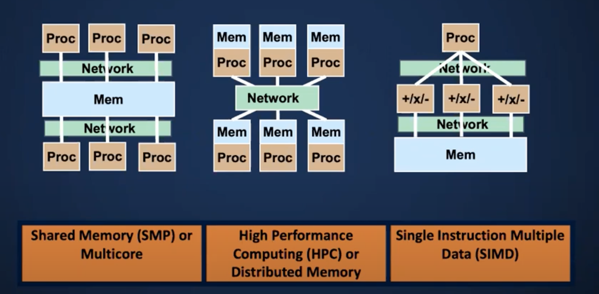

#
# What is a Parallel Computer?

## SMP - Shared Memory/Mut Multiprocessor

A **SMP** by connecting multiple processors to a single memory system

- A **multicore processor** contains multiple processors (cores) on a single chip. —— SMP的子类
- 广义上来讲，其实不需要集成在一个chip上

因此，本质上，我们日常所使用的PC (Personal Computer) 就是所谓的SMP

## HPC - High Performace Computing / Distributed Memory

- A **distributed memory multiprocessor**  has processors with their own memories connected by a high speed network.
    - Also called a cluster
    - 这个本质上就是多个CPU并联，
        - 但是物理上具体是连接到同一个主板，还是简单的多个电脑物理连接还未知
- A **high performace com puting** system contains 100s or  1000s of such processors (nodes)

## SIMD - Single Processor Multiple Data

- A **Single Processor Multiple Data** computer has multiple processors (or functional units) that perform the same operation on multiple data elements at once.
- Most single processors have SIMD units with 2-8 way parallelism
- Graphics processing units (GPUs) use this.

# Questions

- Why is high-performace computing often synonymous (同义的) with parallel computing?
    - **Answer: Performance = parallelism**
- Why do we care so much about interconnect (互连) and communication?
    - SMP, HPC, and SIMD are how thses processors are connected in different ways
    - **Answer: Efficiency = locality**

> **Performance = parallelism
Efficiency = locality
—— Bill Dally (NVIDIA and Standford)**
> 

# What’s not a Parallel Computer?

## Concurrency (并发性) vs. Parallelism

- Concurrency: multiple tasks are ***logically*** active at one time.
    - Example: 
    你在电脑上打开一个网页，同时在放音乐，并且微信在接受消息
    - 这里会让你产生在并行的错觉
    - 这种本质上称作任务的并行 —— 并发

- Parallelism: multiple tasks are ***actually*** active at one time.
    - Example:
    你在计算 1+1 = 2 的同时，计算 2+2 = 4
        - 因此，如果你只有一个线程，这两件事会有冲突。但并发则会因为延迟过低的原因让你产生两件事情是同时进行的错觉。

## Parallel Computer vs. Distributed System

- A distributed system is ***inherently (本质上)*** distributed, i.e., serving clients (客户) at different locations.

single monolithic entity

- A parallel computer may use ***distributed memory*** (multiple processors with their own memory) for more performance.
- In reality, even servers are distributed to make sure that when one component fails, you stills can access online banking account.
- 在现实中，分布式系统广泛的应用于服务器，我们所熟知的淘宝，拼多多等，都是这类型。这种类型可以保证短时间内大量客户进行访问。

# Units of Measure for HPC

- High Performance Computing units are:
    - Flop: floating point operation, usually double precision unless noted
    - Flop/s: floating point operations per second
    - Bytes: size of data (a double percision floating point number is 8 bytes)
- Typical sizes are millions…
    
    
    
- Current fastest machines:
    
    [Home -  | TOP500](http://www.top500.org)
    

# Simulation && HPC

High Performance simulation used to understanding things that are:

- Too big
- Too small
- Too fast
- Too slow
- Too expensive or dangerous

for experiments

# Data Analytics && HPC

High Performance Data Analytics (HPDA) is used for data sets that are:

- Too big
- Too complex
- Too fast
- Too noisy
- Too heterogeneous

for measurement alone.

# Amdahl’s Law

- Suppose only part of an application is parallel
- Amdahl’s law
    - s = fraction of work done sequentially (Amdahl fraction)
    - 1-s is fraction parallelizable
    - P = number of processors
    
    $$
    \begin{equation}
        \begin{split}
            \text{Speedup}(P) &= \frac{\text{Time}(1)}{\text{Time}(P)} \\
                              &≤ \frac{1}{(s+(1-s)/P)} \\
                              &≤ \frac{1}{s}
        \end{split}
    \end{equation}
    $$
    
    - Even if the parallel part speeds up perfectly, performance is limited by the sequential part
        - 无论你做的多好，加速都不是线性