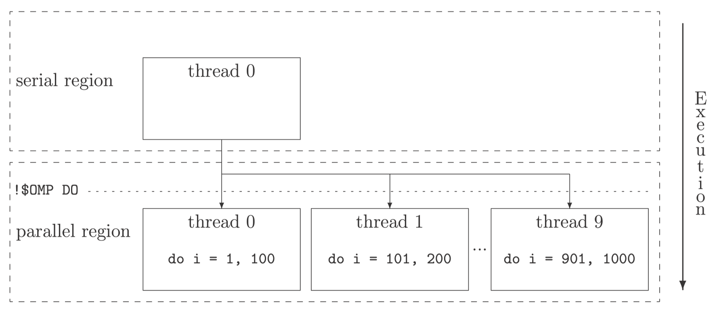

## Two familers of parallel machines

### Shared-memory architecture

These parallel machines are build up on a set of processors which have access to a common memory. Usually the name of **SMP machines** is used for computers based on this architecture, where SMP stands for **Symmetric Multi Processing**.

### Distributed-memory architecture

In these parallel machines each processor has its own private memory and information is interchanged between the processors through messages. The name of **clusters** is commonly used for this type of computing devices.


### OpenMP

A new industry standard has been created with the aim to serve as a good basis for the development of parallel programs on **shared-memory machines**.


## Open the directives of OpenMP and conditional compliation

```Fortran
!$OMP

!$
```

`!$OMP`: The OpenMP-compliant compiler knows that the following information in the line is an OpenMP directive.


`!$`: The corresponding line is said to be affected by a **conditional compilation**. When execution start, these two characters `!` and `$` will be replaced by two white spaces so that the compiler is taking into account the line

## Parallel regions

```Fortran
!$OMP PARALLEL

!$OMP END PARALLEL
```

## OpenMP constructs

```Fortran
!$OMP DO 
    do i = 1, 1000 
    ...
    enddo 
!$OMP END DO
```


