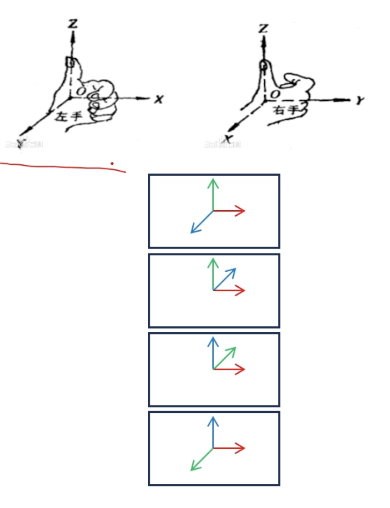

## 点、线、面

- 坐标系选取
  - Cartesian coordinates (笛卡尔坐标系)
  - 原点任意选，y/z 复方向选为重力方向
    - Maya, Houdini : y轴为竖直方向，右手系
    - Unity3D，Cinema4D： y轴为竖直方向，左手系
    - Blender: z轴为竖直方向，右手系
    - Unreal: y轴为竖直方向，左手系

- 点的表示
  - 一般定义为矢量
    - position vector(位置矢量)
  - 图形学的库 / 软件：与矢量进行区分，class Point $\neq$ class Vector
    - Point - Point -> Vector

- 线的表示
  - 直线 / 射线： $$

- 面的表示
  - 无穷大平面

### 点与线的距离 
(没有定义的时候，对于2D / 3D都适用)
- 点与直线的距离

- 点在直线上的投影

- 点与射线的距离

### 线与线的位置关系(2D)

- 共端点射线 / 线段的绕序
  - 射线

- 直线与直线的交点

- 线断的跨立测试

### 线与线的位置关系(3D)

- 异面直线之间的距离

- 异面线段之间的距离
  - 投影至同平面进行跨立测试；优化问题求极值

### 点与面的距离

- 点与面
  - 平面
  - 平面外一点
- 点与面的距离
  - $\text{Dist} = ||(x-p) \cdot n|| / ||n||$
    - 该距离不受 $p$ 点选取的影响
  - 向量形式与解析形式的关系
    - 

## 多边形的周长与面积(2D)

- 多边形的周长
  - 遍历每条边计算摸长求和
- 多边形的面积（逆时针序给出多边形）
  - 三角形面积
  - 凸多边形的面积
- 点与凸多边形位置关系
  - 面积法
    - $A = \sum_{i=0,j=(i+1)}$
  - 扰序法
  - 思考：多面体的体积、点与凸多面体的位置关系（3D）
- 点与任意多边形的位置关系
  - ray casting 光线投射算法
  - winding number 会转数算法

### 光线投射算法
- Jordan 若尔当曲线定理：任意一条简单

### 回转数算法

- Winding number 回转数

## 点到三角形的距离

- 二维情形

- 三维情形

## 三角形之间的距离

- 二维情形

- 三维情形

- 三角形距离与碰撞检测
  - Discrete Collision Detection (DCD), 离散碰撞检测
  - Continuous Collision Detection (CCD), 连续碰撞检测

## Delaunay 三角剖分(2D)
- 三角部分
- Delaunay三角剖分
  - 空圆性
  - 规则化
  - 其他性质
  - Voronoi 图：三角剖分的对偶图

## 凸包(2D)

- 凸包的定义
  - 在平面上能包含给定点的最小的凸多边形
  - 凸多边形：所有内角均小于180
- 凸包与包围盒
  - AABB
  - OBB
  - FDH

- Graham (葛立恒)扫描法
  - 点集中纵坐标最小的点一定在凸包上
  - 在凸包上逆时针走，所经过的边一定是“左拐”的
  - 算法流程

## 凸包(3D)

- 增量法
  - 给定 $n-1$ 个点的凸包，考察新点的加入
  - 时间复杂度$O(n^2)$
  - 如何处理多点共面的情况

## 平面最近点对(2D)

- 分治算法 (有应用，但是不多)

## 最小圆覆盖(2D)

- 最小圆覆盖：包围盒 -> 包围球(2D)
- 最小覆盖圆的性质
- 最小圆覆盖的增量构造（与凸包一致）

- 随机增量法
  - 算法流程(三层循环)
  - 期望时间复杂度$O(n)$
    - 最小覆盖圆至多只需要三个特定点确定
    - 每次进入下层循环的概率仅为$O(\frac{3}{i})$
  - 最小球覆盖
    - 三种情况 -> 四种情况（4点确定球面）
  - 模拟退火
    - 随机圆/球心，取距离最大值为半径

光线追踪的时候：AABB
实时碰撞检测：球覆盖

## 反演变换

- 点的反演
  - 给定反演中心$o$和反演半价$r$
  - $p$ 与 $p'$ 互为反演点
    - $o，p, p'$ 三点共线
    - 
  - 性质：圆$o$外（内）的点，反演点在圆 $o$ 内（外）
- 过点$o$ 的圆的反演点
- 不过点 $o$ 的圆的反演(2D)
  - 依旧不过点 $o$ 的圆
- 反演的应用
- 反演的