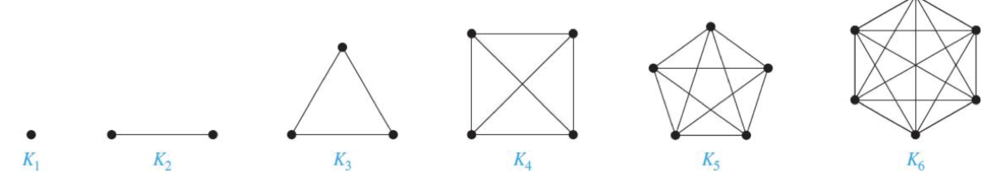

## Directed graph, vertices, edges, undirected graph, vertext set, edge set

::: important Directed graph, vertecs and edges

- Let $V$ be a finite nonempty set, and let $E \subseteq V \times V$. 

- The pair $(V,E)$ is called **directed graph** on $V$, where $V$ is the set of vertices, and $E$ is its set of **edges**.

- We write $G = (V,E)$ to denote a graph.
:::

::: important Undirected graph
Whe we not concern the direction (方向) of  any edge, we still write $G = (V,E)$.

Now, $E$ is a set of unordered (无序的) pairs of elemets takens from $V$, and $G$ is called an **undirected graph**.
:::

::: tip
Whether $G=(V,E)$ is directed or undirected, we call $V$ the **vertex set** of $G$ ,and $E$ is the **edge set** of $G$.
:::

## Multigraph and simple graph

## Complete graph

::: important Complete graph
The **complete graph** on [$V$](#directed-graph-vertices-edges-undirected-graph-vertext-set-edge-set), denoted $K_n$, is a loop-free undirected graph, where for all $a,b\in V, a\neq b$, there is an edge $\{a,b\}$.
:::

- $K_n$, for $1\leq n\leq 6$:

## Circle graph & Path graph

## Trace of Matrix

The sum of the diagonal of $A$ is called the ==trace== of $A$ and is denoted by $\text{tr}(A)$.

::: note Example
$$
A(G) = \begin{pmatrix}
   a_{11} &a_{12} &\cdots &a_{1n}\\
   a_{21} &a_{22} &\cdots &a_{2n}\\
   \vdots &\vdots &\ddots &\vdots\\
   a_{n1} &a_{n2} &\cdots &a_{nn}\\
\end{pmatrix}
$$

Then,
$$
\text{tr}(A) = (a_{11} + a_{22} + \cdots + a_{nn})
$$
:::
