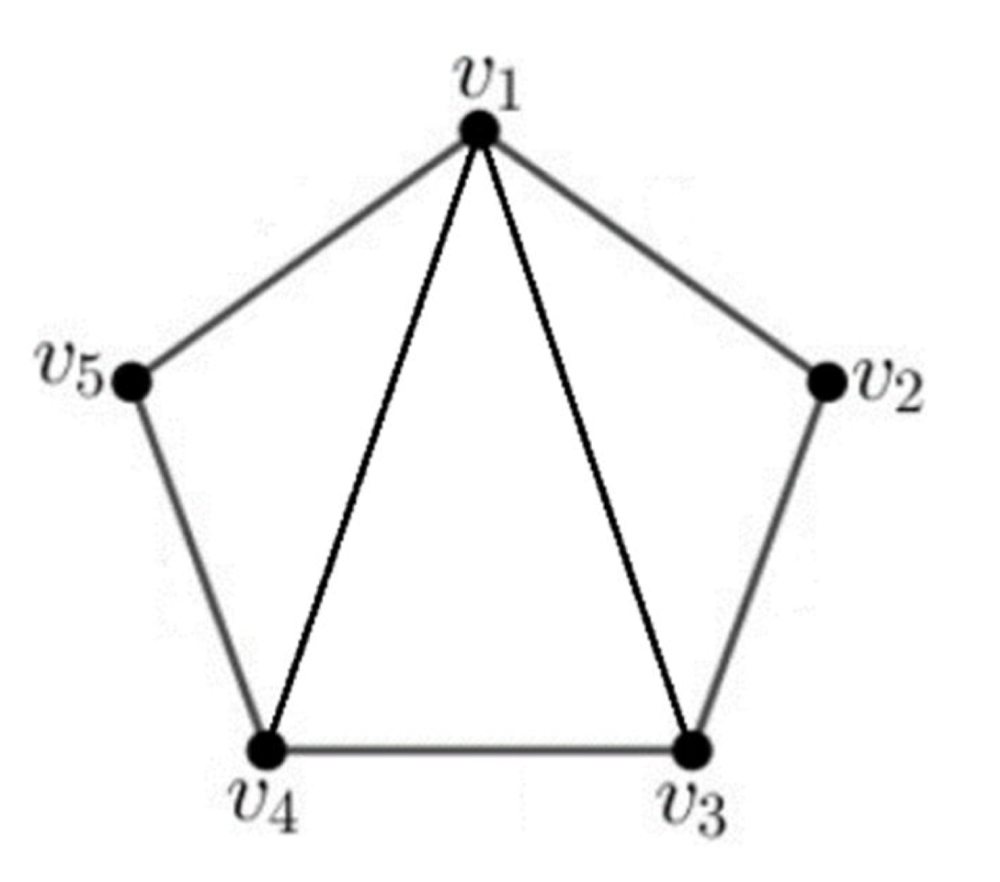

## Adjacency Matrix
::: important Definition 1.1

Let $G = (V,E)$ be a graph whose vertex-set $V(G) = \{v_1,v_2,...,v_3\}.$ The **adjacency matrix** of $G$ is an $n \times n$ Matrix $A(G)$ whose entries $a_{ij}$ are given by:

$$
\begin{equation}  
a_{ij} = \left\{  
    \begin{array}{lr}
    1, \text{ if } v_{i} \text{ and } v_{j} \text{ are adjacent} \\
    0, \text{other}
    \end{array}  
\right.  
\end{equation} 
$$
:::

这个定义有如下几个性质：
1. The adjacency matrix of $G$, $A(G)$, is **symmetric**, that is $a_{ij} = a_{ji}$
2. Since a simple graph has no loops, diagonal entry $a_{ii} = 0,i = 1,2,...,n$
3. The $i-$th row or column sum equal to $\deg(v_i)$.

::: tip Lemma 1.2 
The number of walks of length $l$ in $G$, from $v_i$ to $v_j$, is the entry in position $(i,j)$ of the matrix $A(G)^{l}$.

[Proof of Lemma 1.2](./Proof_of_Chapter_1/Lemma_1.2_proof.md)

:::

- Example:
  - $A(G)^{1} = A(G)$ 表示第$v_i$点只走一步至$v_j$的路径个数
$$
 A(G) = \begin{bmatrix}
    &0& 1& 1& 1& 1& \\
    &1& 0& 1& 0& 0& \\
    &1& 1& 0& 1& 0& \\
    &1& 0& 1& 0& 1& \\
    &1& 0& 0& 1& 0& \\
\end{bmatrix}
$$
  - $A(G)^{2} = A(G) \cdot A(G)$ 表示第$v_i$点只走2步至$v_j$的路径个数
$$
 A(G)^{2} = \begin{bmatrix}
    &4& 1& 2& 2& 1& \\
    &1& 2& 1& 2& 1& \\
    &2& 1& 3& 1& 2& \\
    &2& 2& 1& 3& 1& \\
    &1& 1& 2& 1& 2& \\
\end{bmatrix}
$$

There are 4 walks from $v_1$ to $v_5$
$$
v_1 \to v_2 \to v_3 \to v_4 \to v_5
$$

## Spectrum of Matrix
::: important Definition 1.4 

1. The **spectrue** of a square matrix $M$ is the set of eigenvalue(特征值) of $M$, together with their multiplicities(数量)
2. If the distinct eigenvalue of $M$ are $\mu_1,\mu_2,\cdots,\mu_k$，and the multiplicities are $m(\mu_1),m(\mu_2),\cdots,m(\mu_k)$, then we write

$$
\text{Spec}(M) = 
\begin{pmatrix}
    \mu_1 &\mu_2 &\cdots &\mu_k \\ 
    m(\mu_1) &m(\mu_2) &\cdots &m(\mu_k)
\end{pmatrix}
$$

:::

::: info Example 1.5
The [complete graph](../Basic_concept.md#complete-graph) has adjacency matrix
$$
A(K_n) = 
\begin{pmatrix}
    0 &1 &\cdots &1\\
    1 &0 &\cdots &\vdots\\
    \vdots &\ddots &\ddots &1\\
    0 &\cdots &1 &1\\
\end{pmatrix}_{n\times n}
$$

Consider the 
$$
J_n = I_n + A(K_n) = 
\begin{pmatrix}
    1 &1 &\cdots &1\\
    1 &1 &\cdots &\ddots\\
    \vdots &1 &\cdots &1\\
    1 &\cdots &1 &1\\
\end{pmatrix}_{n\times n}
$$

Since the rank of $J_n = 1$（对于可对角化的矩阵来说，矩阵的非零特征值的数量等于矩阵的秩）, $0$ is an eigenvalue of $j_n$ with multiplicity of $n-1$.

Since 
$$
\mu_1 + \mu_2 + \cdots + \mu_n = \text{ Tr }(J_n) = n
$$
the last eigenvalue $\mu_n = n$.

So, the trace of matrix:
The sum of the diagonal elements of matrix $A$ is called the trace of matrix and is denoted by $\text{tr}(A)$.
$$
\text{ Spec }(J_n) = \begin{pmatrix}
    n &0\\
    1 &n-1
\end{pmatrix}

$$

Hence, $J_n$ 与 $A(K_n)$ 的区别就是差了一个 $I$。因此只需讲 $J_n$ 的特征值 -1，即为 $A(K_n)$ 的特征值.
$$
\text{Spec}(A(K_n)) = \begin{pmatrix}
    n-1 & -1\\
    1 &n-1
\end{pmatrix}
$$
:::

## Subgraph

## Characteristic Polynomial

## Bipartite

## Diameter

## Regular graph & Regular connected graph

## Line graph

