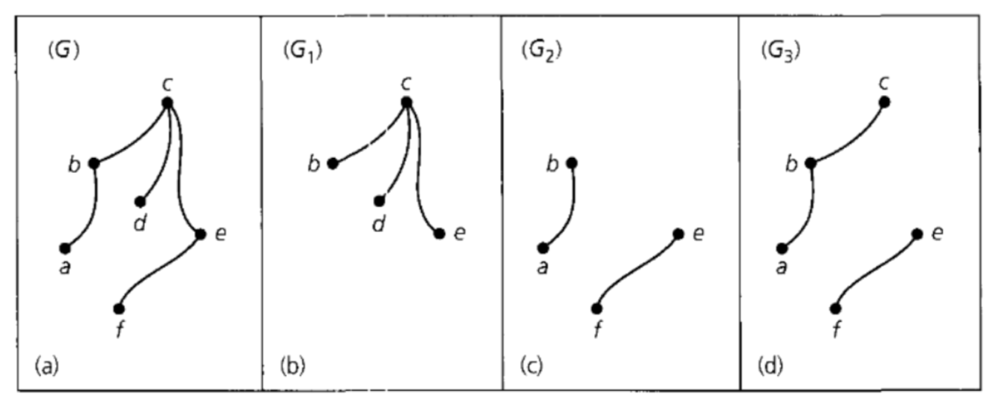

## Adjacency Matrix
::: important Definition 1.1

Let $G = (V,E)$ be a graph whose vertex-set $V(G) = \{v_1,v_2,...,v_3\}.$ The **adjacency matrix** of $G$ is an $n \times n$ Matrix $A(G)$ whose entries $a_{ij}$ are given by:

$$
\begin{equation}  
a_{ij} = \left\{  
    \begin{array}{lr}
    1, \text{ if } v_{i} \text{ and } v_{j} \text{ are adjacent} \\
    0, \text{other}
    \end{array}  
\right.  
\end{equation} 
$$
:::

这个定义有如下几个性质：
1. **对称:** The adjacency matrix of $G$, $A(G)$, is **symmetric**, that is $a_{ij} = a_{ji}$
2. **对角线上的点都为零:** Since a simple graph has no loops, diagonal entry $a_{ii} = 0,i = 1,2,...,n$
3. **行/列数量为矩阵的degree:** The $i-$th row or column sum equal to $\deg(v_i)$.

::: tip Lemma 1.2 
The number of walks of length $l$ in $G$, from $v_i$ to $v_j$, is the entry in position $(i,j)$ of the matrix $A(G)^{l}$.

[Proof of Lemma 1.2](./Proof_of_Chapter_1/Lemma_1.2_proof.md)

:::

- Example:
  - $A(G)^{1} = A(G)$ 表示第$v_i$点只走一步至$v_j$的路径个数
$$
 A(G) = \begin{bmatrix}
    &0& 1& 1& 1& 1& \\
    &1& 0& 1& 0& 0& \\
    &1& 1& 0& 1& 0& \\
    &1& 0& 1& 0& 1& \\
    &1& 0& 0& 1& 0& \\
\end{bmatrix}
$$
  - $A(G)^{2} = A(G) \cdot A(G)$ 表示第$v_i$点只走2步至$v_j$的路径个数
$$
 A(G)^{2} = \begin{bmatrix}
    &4& 1& 2& 2& 1& \\
    &1& 2& 1& 2& 1& \\
    &2& 1& 3& 1& 2& \\
    &2& 2& 1& 3& 1& \\
    &1& 1& 2& 1& 2& \\
\end{bmatrix}
$$

There are 4 walks from $v_1$ to $v_5$
$$
v_1 \to v_2 \to v_3 \to v_4 \to v_5
$$

## Spectrum of Matrix
::: important Definition 1.4 

1. The **spectrue** of a square matrix $M$ is the set of eigenvalue(特征值) of $M$, together with their multiplicities(数量)
2. If the distinct eigenvalue of $M$ are $\mu_1,\mu_2,\cdots,\mu_k$，and the multiplicities are $m(\mu_1),m(\mu_2),\cdots,m(\mu_k)$, then we write

$$
\text{Spec}(M) = 
\begin{pmatrix}
    \mu_1 &\mu_2 &\cdots &\mu_k \\ 
    m(\mu_1) &m(\mu_2) &\cdots &m(\mu_k)
\end{pmatrix}
$$

:::

::: info Example 1.5
The [complete graph](../Basic_concept.md#complete-graph) has adjacency matrix
$$
A(K_n) = 
\begin{pmatrix}
    0 &1 &\cdots &1\\
    1 &0 &\cdots &\vdots\\
    \vdots &\ddots &\ddots &1\\
    0 &\cdots &1 &1\\
\end{pmatrix}_{n\times n}
$$

Consider the 
$$
J_n = I_n + A(K_n) = 
\begin{pmatrix}
    1 &1 &\cdots &1\\
    1 &1 &\cdots &\ddots\\
    \vdots &1 &\cdots &1\\
    1 &\cdots &1 &1\\
\end{pmatrix}_{n\times n}
$$

Since the rank of $J_n = 1$（对于可对角化的矩阵来说，矩阵的非零特征值的数量等于矩阵的秩）, $0$ is an eigenvalue of $j_n$ with multiplicity of $n-1$.

Since 
$$
\mu_1 + \mu_2 + \cdots + \mu_n = \text{ Tr }(J_n) = n
$$
the last eigenvalue $\mu_n = n$.

So, the trace of matrix:
The sum of the diagonal elements of matrix $A$ is called the trace of matrix and is denoted by $\text{tr}(A)$.
$$
\text{ Spec }(J_n) = \begin{pmatrix}
    n &0\\
    1 &n-1
\end{pmatrix}

$$

Hence, $J_n$ 与 $A(K_n)$ 的区别就是差了一个 $I$。因此只需讲 $J_n$ 的特征值 -1，即为 $A(K_n)$ 的特征值.
$$
\text{Spec}(A(K_n)) = \begin{pmatrix}
    n-1 & -1\\
    1 &n-1
\end{pmatrix}
$$
:::

## Subgraph
::: note
Let $G = (V,E)$ be a graph. 

If $\emptyset \neq U \subseteq V$, the **subgraph of** $G$ **induced by** $U$ is the subgraph whose vertex set is $U$ and which contains all edges $\{x,y\}$(from $G$) for $x,y\in U$, we denote this subgraph by $[U]$.

1. ==contains all edges== 是指包涵$U$的所有边, $U$ 是我们构造的字图
2. ==vertex set== 是指$U$的点的集合
:::

关于 **subgraph** 的理解主要看下面这个例子
::: info Example 1.6

(a) is what we denoted $G = (V,E)$ in above.

In (b) and (c) are the **subgraphs** and **induced** subgraphs of $G$, where (c) is disconnected.

$G_1 = [U_1] = \{b, c, d, e\}$ and $G_2 = [U_2] = \{a, d, f, e\}$.

In (d) is the subgraph but not an induced subgraph of $G$, because the edge $\{c, e\}$ is not present.

(d): $G_3 = [u_3] = \{a, b, c, e, f\}$
:::

## Characteristic Polynomial
这一部分主要是介绍关于图的特征多项式。

针对每一张图，我们都可以写出一条特征多项式。

因此这部分也是==最重要==的一章，因为往后的很多性质都与其特征多项式有或大或小的关系。

### Characteristic polynomial Theorem
::: important Theorem 1.7
The characterristic polynomial of $A(G)$: 

$$
\begin{equation}
    p(A(G),\mu) = det(\mu I_{n} - A(G)) = \mu^{n} + c_1 \mu^{n-1} + c_2\mu^{n-2} + c_3\mu^{n-3} + \cdots + c_n
\end{equation}
$$

1. $c_1$ = 0;
2. $-c_2$ is the number of edges of $G$;
3. $-c_3$ is twice the number of triangles in $G$;
4. $c_n = (-1)^{n}\det(A(G))$, 这一条性质只能用在 $c_n$ 为多项式的最后一项的时候，对于 $c_4 \thicksim c_{n-1}$ 请使用 Theorem 1.18

==记住，characteristics polynomial 的本质是 determinate==

==记住，characteristics polynomial 的本质是 determinate==

==记住，characteristics polynomial 的本质是 determinate==

:::

::: important Theorem 1.8

The graph $G$ with $n$ vertices and $\mu_1, \mu_2, \cdots, \mu_n$ be $n$ eigenvalues of $A(G)$. Then,
1. $\sum_{i=1}^{n}\mu_{i}^{2} = 2|E(G)|$ where $|E(G)|$ is the number of edges in $G$. 

2. $\sum_{i=1}^{n} \mu_{i}^{3} = 6 \times \text{the number of triangles in G}$

**因此，当我们在后面可以得知 $\mu_i$ 的数量，需要求 $\mu$，我们可以使用 1 来列方程解 $\mu$ 的值**
:::

::: important Theorem 1.12

Suppose $v_i$ is a vertex of degree 1 of $G$, and $v_j$ is $v_i$'s neighbor.

Let $G_i = G - v_i$, and $G_{i,j} = G-\{v_i,v_j\}$,then

$$
\begin{equation}
    p(A(G),\mu) = \mu p(A(G_i),\mu) - p(A(G_{i,j}),\mu)
\end{equation}
$$

Then, we can use the Example 1.13 to prove.

:::

::: info Example 1.13

这个定理的主要用途是：你任选一个点

:::

## Bipartite

Bipartite 也是 这一章中一个很重要的知识点，基本上会和 Characteristic Polynomial 相结合, 同时也在作业题里面有所展示。

==Bipartite is not necessarily complete==.

- Complete Graph 可以理解为，任选一个点，它与其他点都有连线

- Not Necessary Complete Graph 可以理解为，任选一个点，它与其他点不需要都有连线

::: important Lemma 1.9

If $G$ is ==bipartite== and $\mu$ is non-zero eigenvalue of $A(G)$ with multiplicity $m$, then $-\mu$ is also an eigenvalue with multiplicity m

:::

这个引理其实就是 Theorem 1.10 的 2 的内容，非零特征值会**成对出现**且 **数量相同**。

这个性质会在后面计算 $\text{Spec}(A(G))$ 的时候被多次用到。

::: important Theorem 1.10

$G$ is a graph with $n$ vertices and $\mu_1, \mu_2, \cdots, \mu_n$ be the eigenvalues of $A(G)$. Then, the following properties are equivalent:
1. $G$ is bipartite.

2. The non-zero eigenvalues $\mu_i, -\mu_i$ of $A(G)$ occur in pairs with the same multiplicity.

3. $p(A(G),\mu) = \left\{\begin{array}{lr} \mu^{n} + c_2\mu^{n-2} + c_4 \mu^{n-4}+ \cdots + c_{n-1}\mu \quad \text{ if }n \text{ is odd}\\ \mu^{n} + c_2\mu^{n-2} + c_4 \mu^{n-4}+ \cdots + c_{n-1} \qquad \text{if }n \text{ is even} \end{array}\right.$

4. $\sum_{i=1}^{n}\mu_{i}^{2t-1} = 0$ for any positive integer $t$.

:::

::: info Example 1.11

The vretices of ==complete bipartite graph $K_{a,b}$== are labelled in $\{1, \cdots, a\}$ and $\{a+1, \cdots, a+b \}$ which are 2 sets of ==non-adjacent== vertices.

Then, the adjacency matrix is 
$$
A(K_{a,b}) = \begin{pmatrix}
    0_{a,a}& J_{a,b} \\
    J_{b,a}& )_{b,b} 
\end{pmatrix}_{(a+b)\times (a+b)}
$$

where $J_{m,n}$ is
$$
J_{m\times n} = \begin{pmatrix}
    1& 1& \cdots& 1\\
    \vdots& \vdots& \vdots& \vdots\\
    1& 1& \cdots& 1\\
\end{pmatrix}_{m \times n}
$$

Then, there have some consequence for ==complete bipartite graph $K_{a,b}$==

- The matrix $A(k_{a,b})$ has just two linearly independent rows, and its **rank** is 2
- 0 is an eigencalue of $A(K_{a,b})$ with multiplicity $a + b -2$
- The **Characteristic Polynomial** is the form 
$$

\mu^{a+b-2}(\mu^2 + c_2)

$$
werere $-c_2 = ab$ is equal to the number of edhes of $K_{a,b}$

Hence,
$$
\text{Spec}(K_{a,b}) =
\begin{pmatrix}
    \sqrt{ab}& 0& -\sqrt{ab}\\
    1& a+b-2& 1&
\end{pmatrix}
$$

:::

## Diameter

## Regular graph & Regular connected graph

## Line graph

