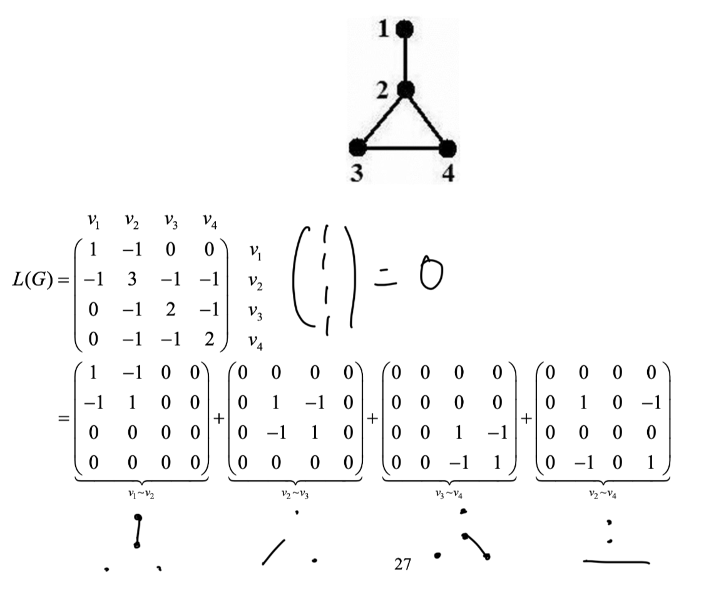

## The definition of Laplacian Matrix

::: important Definition 2.1
Let $G$ be a graph with $n$ vertices, the Laplacian matrix of $G$ is an $n \times n$ matrix $L(G) = (l_{ij})_{n \times n}$ defined as:
$$
\begin{equation}
    l_{ij} :=\left\{
        \begin{array}{lr}
            \deg(v_i), \qquad \text{ if i=j}\\
            -1, \qquad \text{ if }i \neq j \text{ and }v_i \text{ is adjacent to} v_j \\
            0, \qquad \qquad \text{ otherwise }
        \end{array}
    \right.
\end{equation}
$$

Similarly, $L(G)$ is a **symmetric** matrix. And, 
$$
\begin{equation}
    L(G) = D(G) - A(G)
\end{equation}
$$
where $D(G)$ is the degree matrix(对角线上全是 degree，别的地方都是 0 的矩阵) whose diagonal entries are $\deg(v_i)$. $A(G)$ is the adjacency matrix.
:::
### Example 2.2

