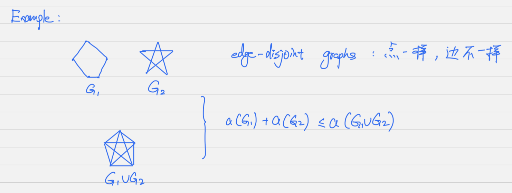
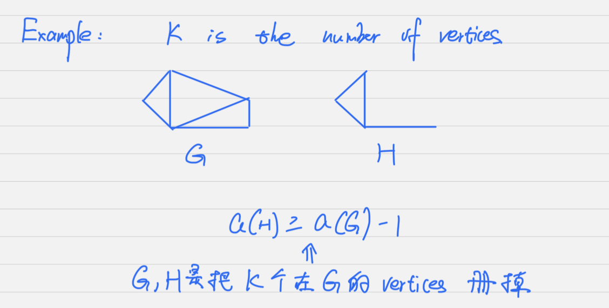
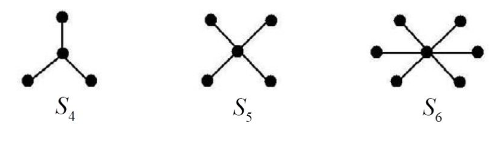
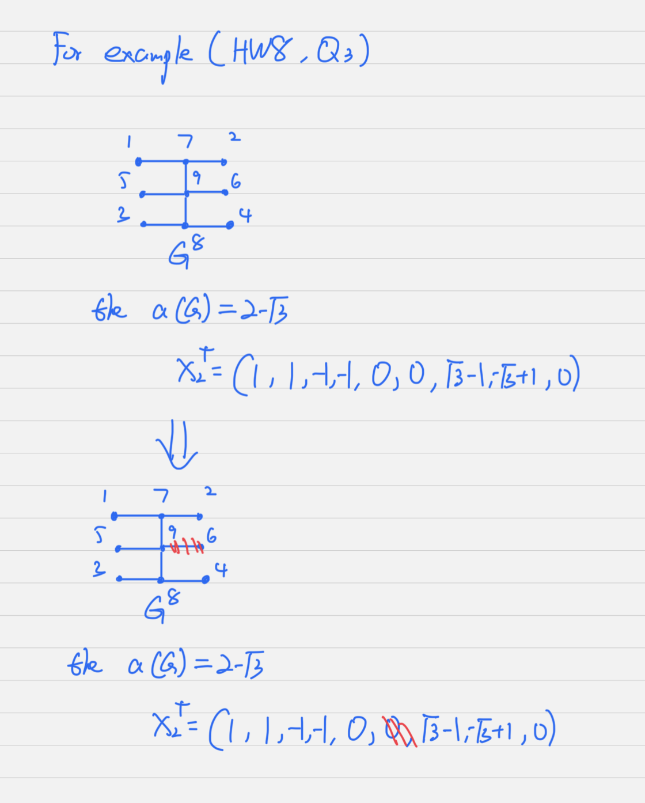

## Definition 5.1

::: warning IMPORTANT 
The **algebraic connectivity** of $G$ is the second smallest eigenvalue, $\lambda_2(G)$, of the Laplacian matrix $L(G)$. We denote the algebraic connectivty of $G$ by $a(G)$.

- $\lambda_2(G) = a(G)$
- $\lambda_2(G)$ is the second smallest eigenvalues.
:::

### Lemma 5.2

::: warning IMPORTANT
If $G_1, G_2$ are **edge-disjoint grpah** with the same set of vertices then
$$
\begin{equation}
    a(G_1) + a(G_2) \leq a(G_1 \cup G_2)
\end{equation}
$$

:::

### Corollary 5.3

::: note Corollargy
The function $a(G)$ is non-decreasing for graphs with the same set of vertices, if 
$$
\begin{equation}
    E(G_1) \subseteq E(G_2) \text{ and } V(G_1) = V(G_2)
\end{equation}
$$
Then,
$$
\begin{equation}
    a(G_1) \leq a(G_2) 
\end{equation}
$$

Example:
$$
\begin{equation}
    \begin{array}{lr}
        G \subset K_n - e & \Rightarrow \text{G is the subgraph of } K_n-e \\ 
        \qquad \Downarrow &\\
        a(G) \leq a(K_n - e) &
    \end{array}
\end{equation}
$$
:::

### Lemma 5.5

::: warning IMPORTANT
Let $G$ be a graph and let $H$ be a graph obtained from G by removing $K$ vertices $G$ and all edges.

Then,

$$
\begin{equation}
    a(H) \geq a(G) - K
\end{equation}
$$

:::

### Corollary 5.6
::: note Corollary
Let G be a graph with vertex set $V(G)$. Let $V(G) = V_1 \cup V_2$ are disjoint.

For $i = 1,2$, let $G_i$ be the subgraph of induced by $V_i$.
Then,
$$
\begin{equation}
    a(G) \leq \min\{a(G_1) + |V_2|, a(G)+|V_1|\} \Leftarrow \text{ 两个图拆开后的结论}
\end{equation}
$$
:::

## Definition 5.7

::: note Definition
A connected graph $G$, a vertex $v$ is a **cut vertex** of $G$.
If $G-v$ is connected. A **vertex cut** is a set of vertices $U$ 

s.t.
$$\begin{equation}
    G-U \text{ is disconnected}
\end{equation}
$$

**这个定义在讨论，当我 cut 掉几个点，图可以从** $\text{Connected } \Rightarrow \text{ Disconnected}$
:::

## Definition 5.8

::: warning IMPORTANT
If the cardinality of vertieces in a vertex cut $U$ of a graph $G$ is the minimum number of vertices required to be removed from $G$ (along with its incident edges) to render $G$ disconnected, we say that $U$ is a minimal vertex cut. This cardinality is known as the **vertex connectivity** of $G$ and is denoted by $v(G)$.

- **vertex conectivity**: 对于$G$, 去掉的点成为两个子图的数量，denoted by $v(G)$
:::

### Theorem 5.10
::: warning IMPORTANT
$G$ is a non-complete and connected graph on $n$ vertices.

Then, $a(G) \leq v(G)$ if and only if $G_1 \cup G_2$. Where, 

  - $G_1$ is a disconnected graph on $n-v(G)$ vertices
  - $G_2$ is a graph on $v(G)$ vertices with $a(G) \geq 2v(G) - n$
:::

## Definition 5.12

::: caution KEY POINT - Star graph
A star $S_n$ on $n(\geq 2)$ vertices is a tree consisting of one vertex that is adjacent to the remaining $n-1$ vertices, i.e. $S_n = K_{1,n-1}$.

The Laplacian eigenvalues of $S_n$ are $0,1,...,1,n$, where the number of $1$ is $n-1$

- For $S_4: 0,1,1,4$
- For $S_5: 0,1,1,1,5$
- For $S_6: 0,1,1,1,1,6$
:::

### Corollary 5.14

::: note Corollary
Let $T$ be a tree on $n\geq 3$ vertices.
Then,$a(T)\leq 1$ if and only if $T$ is a [star graph](Chapter_5.md#definition-512)
:::

## Definition 5.15
::: caution KEY POINT - Pendant, Quasipendant
A vertex in a graoh $G$ of degree **one** is called a **pendant vertices**.
  - $p(G)$ denotes the number of **pendant vertices**.

A vertex in $G$ is **quasipendant** if it is adjacent to a pendant vertex.
- $q(G)$ denotes the number of **quasipendant**

$m_{G}(\lambda)$ denotes the multiplicity of the eigenvalue $\lambda$ as an eigenvalue of Laplacian matrix of $G$.
:::

### Theorem 5.16
::: caution Relationship between Pendant, Quasipendant, and the number of eigenvalue equal 1
Let $L(G)$ be the Laplcian matrix for a graph $G$. Then,
$$
\begin{equation}
    m_{G}(1) \geq p(G) - q(G)
\end{equation}
$$
:::

### Theorem 5.17
::: caution KEY POINT
Let $G$ be a graph with $p$ pendant vertices, and let $R$ be the set of inner vertices of $G$. Then, 
$$
S(G) = m_{L[R]}(1) = m_{A}(1)
$$
$$
S(G) = m_{G}(1) - p(G) + q(G)
$$

$A$ 矩阵是 inner vertieces 与 inner vertices 构成的矩阵

$$
\begin{equation}
    L(G) = \begin{bmatrix}
        A &X &0_{r,p} \\
        X &Q &C \\
        0_{r,p} &C^{T} &I_{p} \\
    \end{bmatrix}
\end{equation}
$$
:::

### Theorem 5.19
::: caution KEY POINT
Let $G$ be a graph with $n$ vertices. Denote $m_{G}(I)$ the number of rigenvalue of $L(G)$, multiplicities included, belonging to the interval $I$. Then $m_{G}[0,1] \geq p(G) \leq m_{G}[1, +\infty]$
:::

### Theorem 5.20
::: note Theorem
Let $G$ be a graph with $n$ vertices and $GuvP_3$ be the graph obtained from $G+P_3$ by adding an edge joining the vertex $u$ of $G$ to a pendant vertex $v$ of $P_3$. Then,
$$
\begin{equation}
    m_G(1) = m_{GuvP_3}(1)
\end{equation}
$$
:::

## Definition 5.21
::: note Definition
Denote by $\xi(G)$ the set of eigenvalues of $L(G)$ corresponding to $a(G)$. 

The element of $\xi(G)$ is called **characteristic valuations** of $G$.
:::

### Theorem 5.22
::: caution Characteristic valuation
Let $T = (V,E)$ be a tree on $n\geq 4$ vertices. Suppose there is a **characteristic valuation** $x_2^T \in \xi(T)$ and a pendant vertex $v \in V(G)$ such that $x^T_2(v)=0$. Let $u \in V(G)$ be the quasipendant vertex adjacent to $v$. Denote by $T_1 = (V,E)$ the subgraph obtained from $V$ and $\{u,v\}$ from E.

Then,
$$
\begin{equation}
    \begin{array}{lr}
        \text{(a)} \quad x_2^T(u) = 0 &\\
        \\
        \text{(b)} \quad a(T_1) = a(T) &\\
        \\
        \text{(c)} \quad x^T_2 \in \xi(T),\text{ where }x^T_2 \text{ is the restriction of } x_2^T \text{ to } V_1
    \end{array}
\end{equation}
$$

:::

