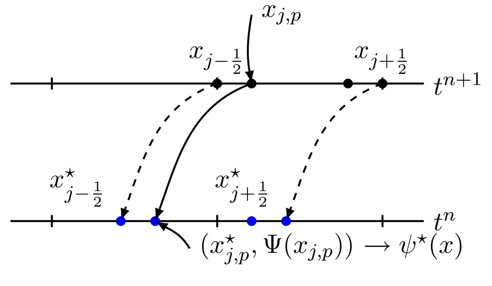
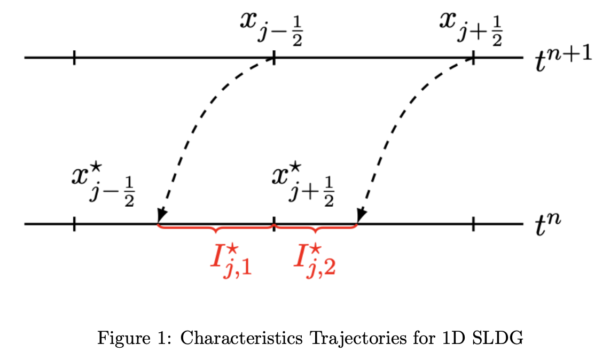

## Equation description

::: tip Firstly, we cnsider the one-dimensional transport equation:
$$
\begin{equation}  
\left\{  
    \begin{array}{lr}
    u_t + (a(x,t)\cdot u)_x = 0, x\in [x_a,x_b] \\
    u(x,0) = u_0(x) \\
    \end{array}  
\right.  
\end{equation} 
$$
:::

- $a(x,t)$ is continuous, and divides in $x_a = x_{\frac{1}{2}}<x_{\frac{3}{2}}< ... < x_{M+\frac{1}{2}} = x_b$
- For $j$-iterm, denoted $I_j = [x_{j-\frac{1}{2}},x_{j+\frac{1}{2}}]$
- Center point: $x_j = \frac{x_{j-\frac{1}{2}}+x_{j+\frac{1}{2}}}{2}$
- Iterm length: $\Delta x_j = x_{j+\frac{1}{2}}-x_{j-\frac{1}{2}}$
- The domain is partitioned by non-overlapping intervals, $\Omega=\cup_{j}I_{j}$.
- The mesh size is denoted $h = \max_{j}\Delta x_{j}$.
- n-th time level with $\Delta t^{n} = t^{n+1}-t^{n}$

::: tip Approximation space (近似空间)

$$
    V_{h}^{k} = \{v_h : v_h|_{I_j}\in P^k(I_j)\} \Psi_{i}(x)
$$

- $k \geq 0$
- $P^k(I_j)$ denotes the set of **Orthnogonal Legendre polynomials** of degree at the most $k$ over $I_j$ interval.
- If $k = 0$, the scheme formulated below problated below reduces to a first order SL finite volumme scheme.
:::

Introduce the test function $\psi(x,t)$, satisfying the boundary conditions $\psi(x,t^{n+1}) = \Psi(x \in P^{k}(I_j)$, yields the following expression:

$$
\begin{equation}
    \psi_t + a(x,t)\psi_x = 0,t\in [t^n,t^{n+1}]
\end{equation}
$$

The preceding equations (2), presented in adjective form, maintain a constant solution along a characteristic trajectory. Subsequently, as demonstrated in, it can be established that:

$$
\begin{equation}
    \frac{d}{dt}\int_{\widetilde{I_{j}}(t)} u(x,t)\psi(x,t)dx = 0
\end{equation}
$$

where ${\widetilde{I_{j}}(t)}$ is a dynamic intervel bounded by characteristcs emanating from cell boundaries of $I_j$ at $t=t^{n+1}$.

::: tip Prove for (3) One-dimentional Reynolds transport theorem
According to one-dimentional Reynolds transport theorem,
$$
\begin{equation}
    \frac{d}{dx}\int_{a(t)}^{b(t)}f(x,t)dx = \int_{a(t)}^{b(t)}\frac{\partial f(x,t)}{\partial t}dx + (\frac{\partial b(t)}{\partial t}f(b(t),t) - \frac{\partial a(t)}{\partial t}f(a(t),t))
\end{equation}
$$
Then, along the characteristic line $\gamma:\frac{dx}{dt} = a(x,t)$, we can have:
$$
\begin{equation}
    \frac{d}{dt}\int_{\widetilde{I_j}(t)}u(x,t)\psi(x,t)dx = \bigg[\frac{dx}{dt}u(x,t)\psi(x,t) \bigg]\Bigg|_{x = x_{j-\frac{1}{2}}}^{x = x_{j+\frac{1}{2}}} + \int_{I_j(t)}u_t(x,t)\psi(x,t)dx + \int_{I_j(t)}u(x,t)\psi_t(x,t)dx
\end{equation}
$$

$$
\begin{equation}
    \frac{d}{dt}\int_{\widetilde{I_j}(t)}u(x,t)\psi(x,t)dx = au\psi|_{x=x_{j+\frac{1}{2}}} - au\psi|_{x = x_{j - \frac{1}{2}}} - \int_{I_j(t)}\frac{\partial (a \cdot u)}{\partial{x}}\psi(x,t)dx - \int_{I_j(t)} u\cdot a \psi_x
\end{equation}
$$

$$
\begin{equation}
    \frac{d}{dt}\int_{\widetilde{I_j}(t)}u(x,t)\psi(x,t)dx = 0
\end{equation}
$$

where $u_t(x,t) = \frac{d u(x,t)}{dt}$ and $\frac{dx}{dt} = a(a,t)$, then 

$$
\frac{\partial{x}}{\partial{u}} \frac{du}{dt} = a(a,t) \xrightarrow{} \frac{du}{dt} = a(x,t)\frac{\partial{u}}{\partial{t}}
$$

$$
\int_{I_j(t)}u_t(x,t)\psi(x,t)dx = \int_{I_j(t)}\frac{\partial (a \cdot u)}{\partial{x}}\psi(x,t)dx
$$
:::

Given $u^n \in V_h^k$, we seek $u^{n+1}\in V_h^k$, such that for $\forall \Psi \in P^k (I_j),j=1,...,k$。 An SL time discretization of equation(3) leads
to

$$
\begin{equation}
    \int_{I_j}u^{n+1}(x,t)\Psi dx = \int_{I^{*}_{j}}u(x,t^n)\psi(x.t^n)dx
\end{equation}
$$

where $I^{*}_{j} = [x^{*}_{j-\frac{1}{2}},x^{*}_{j+\frac{1}{2}}]$ with $x^{*}_{j\pm \frac{1}{2}}$ being the foots of trajectory emanating from $(x^{*}_{j\pm \frac{1}{2}},t^{n+1})$ at the time $t^n$. Then, update the numerical solution $u^{n+1}$.

## Implementation
### Step 1
Initially, we select $k+1$ interpolation points $x_{j,p}$, where $p = 0,...,k$(此时0到k就正好是k+1个), empolying methods like Gauss-Lobatto points within the interval $I_j$.





::: tip Gauss-Lobatto
Utilizing Gaussian quadrature with a weighting function $W(x)=1$, encompassing the endpoints of the interval $[-1,1]$, involves a total of n abscissas, resulting in $r=n-2$ free abscissas. The abscissas are symmetric about the origin, and the general formula is given by:
 $$
 \begin{equation}
     \int_{-1}^{1}f(x)dx = w_1 f(-1) + w_n f(1) + \sum_{i=2}^{n-1}w_if(x_i).
 \end{equation}
$$
 The unrestricted abscissas $x_i$ for $i=2, ..., n-1$ correspond to the roots of the derivative $P_{n-1}^{'}(x)$, where $P(x)$ represents a Legendre polynomial. The weights associated with these unrestricted abscissas are:
 $$
\begin{equation}
     w_i = - \frac{2n}{(1-x_i^2)P^{''}_{n+1}P^{'}_{m}(x_i)}= \frac{2}{n(n-1)[P_{n-1}(x_i)]^2}
\end{equation}
$$
 and the endpoint are $w_{i,n}\frac{2}{n(n-1)}$.
:::


Subsequencetly, we determine the footpoints $x^{*}_{j,q}$ through numerical solutions to the trajectory equation.


$$
\begin{equation}
    \frac{dx(t)}{dt} = a(x(t),t), \text{ with } x(t^{n+1}) = x_{j,q}
\end{equation}
$$


```Fortran
    ! assemble gauss lobatto of an upstream element
    ! prepare for interpolating the test function.
    do i = 1,nx
        ! consider an upstream element
        p => element_star(i)
        pe => element(i)
        
        if( nk>0 )then
            p%xgl_star(1) =  vertex_star(i)%coor
            p%xgl_star(nk+1) = vertex_star(i+1)%coor
            !
            if( nk>1 )then
                pe%xgl(1) = vertex(i)%coor
                pe%xgl(nk+1) = vertex(i+1)%coor

                do ii = 2,nk
                    pe%xgl(ii) = pe%xgl(1)+( 1.0/2. + gau_lob(ii,1) )*(  pe%xgl(nk+1)-pe%xgl(1) )

                    call runge_kutta( pe%xgl(ii) , p%xgl_star(ii)   ,dt)
                enddo

            endif
        endif
    enddo
```
::: tip Runge-Kutta 4
Achieved using the Runge-Kutta method as follow,

$$
\begin{equation}
\left\{
    \begin{array}{lr}
        x^{*}_{j,q}=x_{j,q}-\frac{\Delta t}{6}(k_1+2k_2+2k_3+k_4) \\
        k_1 = a(x_{j,q},t^{n+1}),\\
        k_2 = a(x_{j,q}-\frac{\Delta t}{2}k_1,t^{n+\frac{1}{2}}), \text{ where } t^{n+\frac{1}{2}} = t^{n}+\frac{1}{2}\Delta t\\
        k_3 = a(x_{j,q}-\frac{\Delta t}{2}k_2, t^{n+\frac{1}{2}}),\text{ where } t^{n+\frac{1}{2}} = t^{n}+\frac{1}{2}\Delta t\\
        k_4 = a(x_{j,q}-\Delta t k_3, t^{n})
    \end{array}
\right.
\end{equation}
$$

ahieves fifth-order accuracy $O(h^5)$. Since for RK4, the local truncation error is on the order of $O(h^5)$, where $h$ is the step size.
::: 
### Step 2

Recalling that the test function $\psi(x,t)$ resolves the final-value problem and consequently remains constant along the characteristics i.e., $\psi(x^{*}_{j,q}) = \Psi(x_{j,q})$. Our next step is to ascertain the unique polynomial $\psi^{*}(x)$ of degree $k$. This polynomial is chosen such that it interpolates $\psi(x,t^n)$ with the pairs $(x^{*}_{j,q},\Psi(x_{j,q}))$ for $q=0, \ldots, k$.

we assume that $\psi^{*}(x)=a_0 + a_1 x + a_2 x^2 + \ldots + a_k x^{k}$, and $\psi^{*}(x)$ satisfies,

$$
\begin{equation}
\left\{
    \begin{array}{lr}
        a_0 + a_1 x^{*}_{j,0} + a_2 x^{*\quad2}_{j,0} + \ldots + a_k x^{*\quad k}_{j,0} = \Psi(x_{j,0})\\
        a_0 + a_1 x^{*}_{j,1} + a_2 x^{*\quad2}_{j,1} + \ldots + a_k x^{*\quad k}_{j,1} = \Psi(x_{j,1})\\
        \vdots \\
        a_0 + a_1 x^{*}_{j,k} + a_2 x^{*\quad2}_{j,k} + \ldots + a_k x^{*\quad k}_{j,k} = \Psi(x_{j,k})\\
    \end{array}
\right.
\end{equation}
$$
Or we need to use the orthogonal polynomial 1d form or Legendre polynomials
::: tip Legendre polynomials in [-1,1]

$$
\begin{equation}
    \xi = \frac{2(x-x_j)}{h_j} \in[-1,1], \forall x\in I_{j}
\end{equation}
$$
The first several polynomials are defined as 
$$
p_0(\xi) = 1, p_1(\xi) = \xi, p_2(\xi) = \frac{1}{2}(3\xi^{2}-1), \\
p_3(\xi) = \frac{1}{2}(5\xi^{3}-3\xi)
$$

In the each interval $I_{j}$, we can take the local functions $\{\psi_{l}(x)\}_{l=0}^{l=k}$

$$
\psi_{l}(x) = p_{l}(\xi),x\in I_{j}
$$
:::


Then we can let,
$$
A = \begin{bmatrix}
    1 & x^{*}_{j,0} & x^{*\quad2}_{j,0} &\cdots& x^{*\quad k}_{j,0} \\
    1 & x^{*}_{j,1} & x^{*\quad2}_{j,1} &\cdots& x^{*\quad k}_{j,1} \\
    \vdots & \vdots & \vdots & \ddots & \vdots\\
    1 & x^{*}_{j,k} & x^{*\quad2}_{j,k} &\cdots& x^{*\quad k}_{j,k} \\
\end{bmatrix}
$$

$$
X = \begin{bmatrix}
    a_0 \\ a_1 \\ \vdots \\ a_k
\end{bmatrix},
B = \begin{bmatrix}
    \Psi(x_{j,0})\\\Psi(x_{j,1})\\\vdots\\\Psi(x_{j,k})\\
\end{bmatrix}
$$

Then system (11) can be expressed in matrix from $AX=B$. Then we need to find the coefficients $a_0,a_1,\cdots a_k$ of the $\psi^{*}(x)$.

### Step 3

Detect interval/sub-intervals within $I^{*}_{j} = \cup_{l}I^{*}_{j,l}$, which are the intersections bewteen $I^{*}_{j}$ and the grid elements(l is the index for sub-interval). Here $l$ serves as the index for the sub-interval. For each interval, there may exist two sub-intervals: $I^{*}_{j,1}=[x^{*}_{j-\frac{1}{2}},x_{j-\frac{1}{2}}]$ and $I_{j,2}=[x_{j-\frac{1}{2}},x^{*}_{j+\frac{1}{2}}]$, Like the picture below.

Firstly, for each result of $x^{*}_{j-\frac{1}{2}}$ or $x^{*}_{j+\frac{1}{2}}$ we record the distance with the original start point. Then, we calculate the number of subinterval by `(vertex_star(i)%coor-xleft)/dx`.
```Fortran
do i = 1 ,nx+1
    call runge_kutta( vertex(i)%coor ,  vertex_star(i)%coor  ,dt)
    !ceiling 是向上取整
    vertex_star(i)%id = ceiling( (vertex_star(i)%coor-xleft)/dx )
enddo
```
And in the implementation, we use a new data structure and create a pointer to obtain all $x^{*}$.
```Fortran
do i = 1,nx
    ! consider an upstream element
    p => element_star(i)
    p%point_origin = vertex_star(i)
    p%point_end = vertex_star(i+1)

    call search_segment(p)
enddo
```
After that, we use the `sgement_search` function, to get all subinterval of an upstream element.

```Fortran
mx = p%point_end%id - p%point_origin%id ! mx也表示x*中有几个点

p%point_inter(0) = p%point_origin !x* 的起始点
p%point_inter(1+mx) = p%point_end !如果x* 都在一个interval里，那么mx = 0, 点就是 p%point_inter(1)
p%nsub = mx+1 !x* 有几个subinterval

if(mx .ne. 0)then
    do kk = 1 , mx
        inter = p%point_origin%id + kk !是第几个x
        p%point_inter(kk)%coor = xgrid( inter ) !通过xgrid找到x的值
        p%point_inter(kk)%id = inter !记录起始点对应的位置
    enddo
endif
!记录每一个subinterval起始点，终点&起始点对应的位置
do kk = 1 , 1 + mx
    p%segment(kk)%porigin = p%point_inter(kk-1)
    p%segment(kk)%pend = p%point_inter(kk)
    p%segment(kk)%id = p%point_inter(kk-1)%id
enddo
```


Finally, we obtain $I^{*}_{j} = \cup_{l}I^{*}_{j,l}$


### Step 4
Using the discontinuous Galerkin method to obtain $u^{n+1}_{h}\in P^{k}(I_j)$, such that the above equation holds for any $\Psi_{h}\in P^{k}(I_j)$.

In the each interval $I_{j}$, we can take the local functions $\{\psi_{l}(x)\}_{l=0}^{l=k}$
$$
\begin{equation}
    \psi_{l}(x) = p_{l}(\xi),x\in I_{j}
\end{equation}
$$
where $p_{l}(\xi)$ is the Legendre polynomials in $[-1,1]$.

The basis functions satisfy the following property:
- $L^2-$orthogonality
$$
\begin{equation}
    \int_{-1}^{1}p_{m}(\xi)p_{n}(\xi)d\xi = \frac{2}{2n+1}\delta_{mn},\forall m,n = 0,1,...,k
\end{equation}
$$
where $\delta_{mn}$ is Kronecker delta,equal to 1 if $m = n$ and to 0 otherwise. Then, the local basis functions $\{\psi_{l}(x)\}$ in $I_{j}$

$$
\begin{equation}
    \int_{I_j}\psi_{m}(x)\psi_{n}(x)dx = \int_{-1}^{1}p_{m}(\xi)p_{n}(\xi)d\xi \cdot \frac{h_j}{2}= \frac{h_j}{2n+1}\delta_{mn}
\end{equation}
$$
Where $h_j$ is the mesh size for sub-interval and this formula means the $\psi$ is linear independent.

Therefore, $u^{n+1}_{h} = P^{k}(I_j)$ can be expressed with $\psi_m$
$$
u^{n+1}_{h} = \sum_{m=0}^{k}\alpha_{m}^{n+1}\psi_m
$$

### Step 5

For $u^{0}_h$, in each element $j$, we can assume $u^{0}_{h} = \sum_{m=0}^{k} = \alpha^{0}_{m}\psi_{n}, \text{ For }n=0,..,k$

$$
\begin{align}
    (u^{0},\psi_{n}) &=\sum_{m=0}\alpha_{m}^{0}(\theta_m,\theta_n) \\
                     &= \alpha_{m}^{0}\frac{h_j}{2m+1}\delta_{mn}
\end{align}
$$
where we obtain $(u^{0},\psi_{n})$ by numerical integration,
$$
\begin{equation}
    \alpha_{m}^{0} = (2m+1) \frac{(u^{0},\psi_{n})}{h_j}
\end{equation}
$$ 

### Step 6

For each element $j$, we have 
$$
\begin{equation}
    \int_{I_j} u^{n+1}_h \Psi_h dx = \int_{I^{*}_{j}}u^{n}_{h}\psi^{n}dx = \sum_{l}\int_{I_{j,l}}u^{*}_{h}\psi^{*}dx
\end{equation}
$$

Note that 

$$
\begin{aligned}
    &m^{j}_{st} = \int_{I_j}\psi_s \psi_t dx = \frac{h_j}{2s+1}\delta_{st} \\
    &b_{s}^{j} = \sum_{l}\int_{I_{j,l}}u^n_h\psi_s^* dx \\

\end{aligned}
$$

The matrix is 

$$
\begin{bmatrix}
    m_{00}^{j} & m_{01}^{j} &\cdots &m_{0k}^{j} \\
    m_{10}^{j} & m_{11}^{j} &\cdots &m_{1k}^{j} \\
    \vdots & \vdots &\cdots &\vdots \\
    m_{k0}^{j} & m_{k1}^{j} &\cdots &m_{kk}^{j} \\
\end{bmatrix}
\begin{bmatrix}
    \alpha_{0}^{j,n+1} \\
    \alpha_{1}^{j,n+1} \\
    \vdots \\
    \alpha_{k}^{j,n+1} \\
\end{bmatrix}
= 
\begin{bmatrix}
    b{0}^{j} \\
    b{1}^{j} \\
    \vdots \\
    b{k}^{j} \\
\end{bmatrix}
$$

### Step 7

$$
\begin{aligned}
    &M^j = [m^{j}_{st}]_{(k+1)\times (k+1)}, \text{ for }s,t=0,\cdots,k\\
    &B^j = [b_{s}^{j}]_{(k+1)\times 1}, \text{ for }s=0,\cdots,k\\
    &X^j = [\alpha^{j,n+1}_{s}]_{(k+1)\times 1}, \text{ for }s=0,\cdots,k

\end{aligned}
$$


Then the global stiffness matrix is 

$$
M = \begin{bmatrix}
    M^{1} & 0 &\cdots &0 \\
    0 & M^{2} &\cdots &0 \\
    \vdots & \vdots &\cdots &\vdots \\
    0 & 0 &\cdots &M^{N} \\
\end{bmatrix}
\\
,
X^{n+1} = \begin{bmatrix}
    X^1 \\
    X^2 \\
    \vdots \\
    X^N \\
\end{bmatrix}
,
B\begin{bmatrix}
    B^1 \\
    B^2 \\
    \vdots \\
    B^N \\
\end{bmatrix}
$$

Finally, we can solve the linear equatiuns systems
$$
\begin{equation}
    MX^{n+1} = B
\end{equation}
$$


