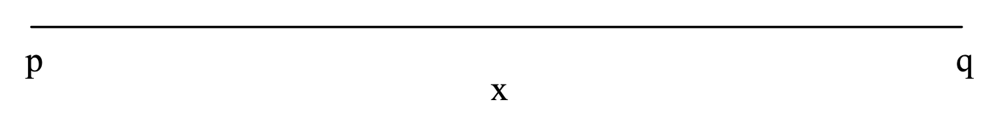
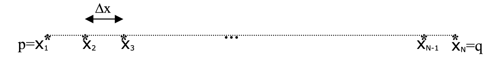

## 1D linear advection equation

::: important 1D linear advection equation
$$
\begin{equation}
    \frac{\partial u}{\partial t} + a \frac{\partial u}{\partial x} = 0, x_{L} \leq x \leq x_{R}, t\geq 0 \tag{1}
\end{equation}
$$
where the independent variables are $t$(time) and $x$(space)
- $x$ is restricted to the finite interval $[p,q]$ which is called the computational domain.
- $a$ is a constant and the denpend variable
- where $u$ = $u(x,t)$

:::


::: important Initial Condition
$$
u(0,x) = \sin(x), p \leq x \leq q \tag{2}
$$
:::


## Step 1: Spatial Discretisation

First we replace the computational domain by a finite set. Because the computaional domain contains infinte number of $x$.

This process we called spatial discretisation.



The computational domain is repalced by a grid of $N$ *equally spaced* grid points.

- The first grid point is $x = p$

- The last grid point is $x = q$

- The constant grid spacing, $\Delta x$
$$
\Delta x = \frac{(q-p)}{N-1}
$$

The values of $x$ in the discretised computational domain are indexed by the subscripts to give,

$$
x_1 = p, \quad, x_2 = p+\Delta x, \quad \cdots \quad, x_N = p + (N-1)\Delta x = q
$$

Since the grid spacing is a constant,

$$
x_{i+1} = x_i + \Delta x
$$


##

Fixing $t$ at $t = t_n$, we approximate the, $u_x$, in [(1)](./1d_yingfeng.md#1d-linear-advection-equation) for each point $(t_n, x_i)$ using the forward difference formula.

$$
u_{x}(t_n,x_i) \approx \frac{u_{i+1}^{n} - u^{n}}{\Delta x}
$$

Then, replacing $u_x$ in [(1)](./1d_yingfeng.md#1d-linear-advection-equation) by its approximation,

$$
u_{t} + a\frac{u_{i+1}^n - u_i^n}{\Delta x} = 0
$$

==which is said to be in *semi-discrete* from since only the spatial derivative has been discretised==
这里是只有空间被离散了

::: note
 The *grid* is also called the *mesh* and the operation of discretising the computational domain is called *gridding* or *meshing*
:::

## Step 2: Time Discretisation

Then, we fix $x$ at $x = x_i$ and we approximate the temporal partial derivative, $u_t$, in [(1)](./1d_yingfeng.md#1d-linear-advection-equation) for each point $(t_n, x_i)$ using the first order forward difference formula to gives,

$$
u_t \approx \frac{u_{i}^{n+1} - u_{i}^{n}}{\Delta t}
$$

Then, substituting the formula and we can get

$$
\frac{u_i^{n+1} - u_i^n}{\Delta t} + a\frac{u^{n}_{i+1} - u^{n}_{i}}{\Delta t} = 0
$$

Which rearranges to gives,

$$
u^{n+1}_{j} = u^{n}_{j} - \frac{a\Delta t}{\Delta x}(u^{n}_{j} - u^{n}_{j-1}) \tag{3}
$$

## Code Implementation

The main file is below
```Fortran
program ying_feng_1D

    use globals1d
    use module_data1d
    implicit none

    ! Variables
    call parameters

    ! Body of ying_feng_1D
    print *, 'Start Run'
    do kkkk = 1,2!7
        !call cpu_time(start)
        
        call setup
        call allocate_var
        
        call init
        
        time = 0.
        
        do while( time < time_final )
            call setdt(time_final)
            call get_stream_tn
        enddo
        
        call deallocate_var
        !call cpu_time(finish)
    enddo
    
    print *, 'End Run'
    pause
    
    contains
    include "setup.f90"
    include "init.f90"
    include "allocate_var.f90"
    include "parameters.f90"
    
    include "setdt.f90"
    include "get_upstream_tn.f90"
    
end program ying_feng_1D


```

### Step 1: Initial Parameters

First, we need to initial some variables which I mentioned above.

It should be a `subroutine`

```Fortran
subroutine init
    implicit none
    integer :: i
    
    dx = (xright-xleft)/nx
    
    do i = 1 - nghost,nx + nghost
        xgrid(i) = xleft + i * dx
    enddo
    
    do i = 1 - nghost,nx + nghost
        vertex(i)%coor = fun_init(xgrid(i))
    enddo
end subroutine init
```
- dx : $\Delta x$
- xgrid(i) : *grid points*
- vertex(i)%coor : the value of initial value at $t_n$ 

The, we need to set up some value for our initial variables like this,

```Fortran
subroutine setup
    implicit none
    
    nx = 10 * 2 ** kkkk
    
    xleft = 0.
    xright = 2. * pi
    
    nghost = 1.
    time_final = 20.
    
    cfl = 0.1 !0.5
    
end subroutine setup
    
    
real function ax(x)
implicit none
real, intent(in) :: x

ax = 1.

end function ax
!***********************
real function exact(x,t)
implicit none
real, intent(in) :: x,t

exact = sin(x-t)

end function exact
!***********************
real function fun_init(x)
implicit none
real, intent(in) :: x

fun_init = sin(x)

end function fun_init
```
#### Varibales

- nx : is the number of *grid/mesh*
- xleft, right: $q,p$ in [(1)](./1d_yingfeng.md#1d-linear-advection-equation)
- nghost : 这个是因为第一个值的预测值需要周期性信息
- time_final : Time distance
- cfl: a number for some pythical conservation and make the time move on.

#### Functions

- ax(x): This is $a$ in the [(1)](./1d_yingfeng.md#1d-linear-advection-equation)
- exact(x) : the exact solution of the PDE
- fun_init: the $u(x,t_0)$


### Step 2: Data structures

I think for this method, we at least need to set two different data structures.

For this file, It should be a `module`

```Fortran
module module_data1d
    
    !data structure
    !***********************
    type, public :: point1d
        sequence
        real :: coor
    end type
    
    type(point1d),allocatable,target,public :: vertex(:)

    !**********************
    type, public :: element1d
        sequence
        !type(point1d) :: porigin, pend
        real :: coor
        !integer :: id
    end type
    
    type(element1d),allocatable,target,public :: element(:)
    !*********************

end module module_data1d
```

The first one is `point1d` which is a public data structure and we have a `real` variable, `coor`.
- `coor`: We need to store the initial value.

The second one is `element1d` which is a public data structure and we have... 编不下去了，当初写着写代码发现这个数据格式没意义，但是留下来了


### Step 3: Start to calculate


First, we need have a for-loop in the main file and It looks like this in my code,

```Fortran
do kkkk = 1,2!7
    !call cpu_time(start)
    
    call setup
    call allocate_var
    
    call init
    
    time = 0.
    
    do while( time < time_final )
        call setdt(time_final)
        call get_stream_tn
    enddo
    
    call deallocate_var
    !call cpu_time(finish)
enddo
```

There have two main file for making the predicted value, `setdt(time_final)` and `get_stream_tn`. ==这两个名字感觉命名的不是很好==

This `setdt` is used for time forward.

```Fortran
subroutine setdt(time_f)
    implicit none
    real,intent(in) :: time_f
    
    ! ste dt and get tn+1
    dt = cfl*dx
    if(time+dt>time_f) dt = time_f - time

    time = time + dt
    
    print *,"Time��", time
    pause
    
end subroutine setdt
```
The `get_stream_tn` is used to execute the equation [(3)](./1d_yingfeng.md#step-2-time-discretisation)

```
subroutine get_stream_tn
    implicit none
    integer i

    element(0)%coor = vertex(0)%coor - dt * (vertex(0)%coor - vertex(nx)%coor)/dx
    element(nx)%coor = vertex(nx)%coor - dt * (vertex(nx)%coor - vertex(0)%coor)/dx
    
    do i = 1,nx
        !element_star(i)%id = i
        !element_star(i)%porigin = 
        !elemnt_star(i)%pend = 
        element(i)%coor = vertex(i)%coor - dt * (vertex(i)%coor - vertex(i-1)%coor)/dx
    enddo
    
    do i = 1 - nghost,nx + nghost
        vertex(i)%coor = element(i)%coor
        print *, time, ",","FDM:", vertex(i)%coor
        
    enddo
    
    pause
    
    do i = 1 - nghost, nx + nghost
        print *, "Error: ", exact(xgrid(i),time)-vertex(i)%coor
    enddo
    pause
        
end subroutine get_stream_tn
```


